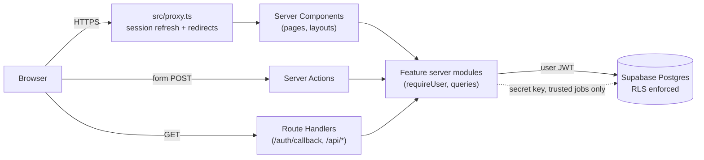
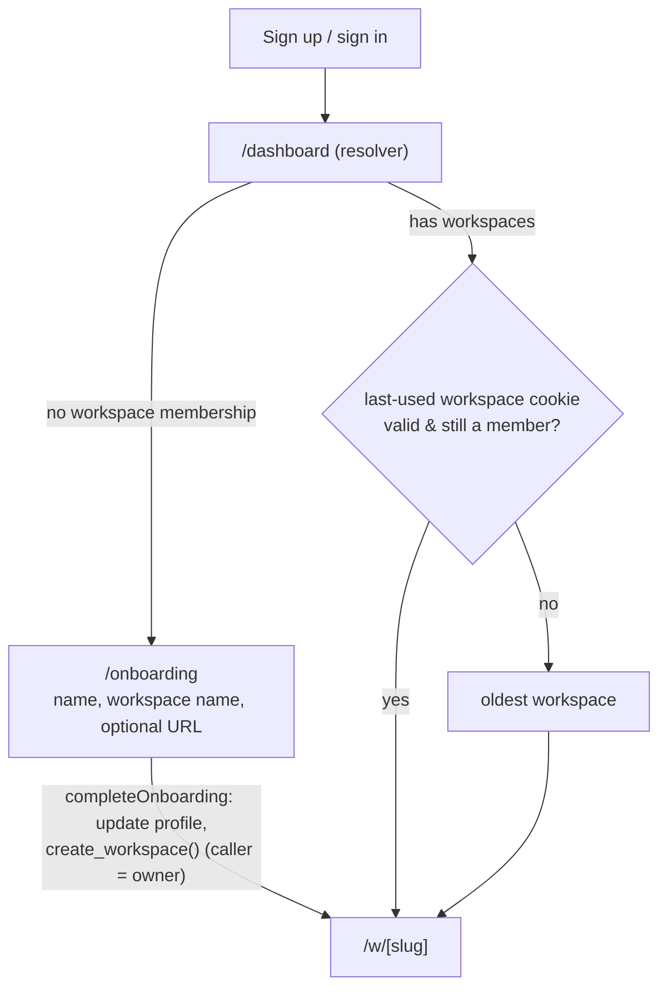

# Architecture

DreamFunnels is an AI-native funnel and website builder. This document describes the system as it
stands after Sprint 1 (authentication, onboarding and workspaces, on the Sprint 0 foundation), the
rules every feature must follow, and the decisions behind them. Keep it current: an architectural
change isn't done until this file says so.

## At a glance

| Concern         | Choice                                                                       |
| --------------- | ---------------------------------------------------------------------------- |
| App framework   | Next.js 16 (App Router, React 19, Turbopack), TypeScript strict              |
| Hosting         | Vercel (Node.js runtime)                                                     |
| Database & auth | Supabase: Postgres 17 + Auth, accessed via `@supabase/ssr`                   |
| Authorization   | Postgres Row Level Security (RLS) + server-side guards                       |
| Authentication  | Supabase Auth, email + password, sessions in HTTP-only cookies               |
| UI              | Tailwind CSS v4, shadcn/ui (Base UI primitives, incl. Toast), lucide         |
| Validation      | Zod 4 at every trust boundary (env, forms, actions)                          |
| Client state    | Zustand, only for ephemeral UI state; React context for app context          |
| Testing         | Vitest (unit, component, database/RLS on PGlite), Playwright (E2E)           |
| CI              | GitHub Actions: typecheck, lint, format, tests, build, E2E on local Supabase |
| Observability   | Structured JSON logs; Sentry- and PostHog-ready seams (no SDKs installed)    |

It's a **modular monolith**: one deployable Next.js app plus one Supabase project. No
microservices, queues or separate APIs until a real need forces one (see "Extension points").



## Repository layout

```
.github/workflows/ci.yml     CI quality gates
docs/                        Architecture, database and QA docs
e2e/                         Playwright specs (smoke: no backend; auth: needs Supabase) + support/
supabase/
  config.toml                Local stack config (auth settings, redirect URLs, ports)
  migrations/                Ordered SQL migrations: the schema's source of truth
  templates/                 Auth email templates (token_hash links that work on any device)
  tests/                     RLS / tenant-isolation tests (Vitest + PGlite)
src/
  app/                       Routes only: thin files that compose features
    (marketing)/             Public pages (landing)
    (auth)/                  login, signup, forgot-password, reset-password (centered card)
    (app)/                   Signed-in area (layout: requireUser)
      dashboard/             Post-sign-in landing: redirects to onboarding or a workspace
      (setup)/               onboarding, workspaces/new (focused layout, no shell)
      w/[workspaceSlug]/     Workspace shell + dashboard home, settings (general, account)
    auth/callback/           Supabase email-link completion (confirm, recovery)
    api/health/              Liveness probe
  components/
    ui/                      shadcn/ui primitives (generated; edit sparingly) + toast.tsx
    layout/                  App shell, sidebar, nav, user menu, settings nav
    providers/app-context.tsx  Authenticated app context (user + current workspace)
    feedback/ forms/ brand/  Empty/error/loading states, form fields, logo
  config/                    Site metadata, the route map, workspace navigation
  features/<feature>/        Vertical slices (see below)
  lib/                       Cross-cutting infrastructure
    env/                     Validated configuration (schema, public, server)
    supabase/                Client factories: server, client (browser), proxy, admin
    logger.ts monitoring.ts analytics.ts errors.ts action-result.ts run-action.ts
  stores/                    Global UI-only Zustand stores
  types/database.types.ts    Supabase-generated DB types
  instrumentation.ts         Server error hook (onRequestError)
  proxy.ts                   Next.js proxy (formerly "middleware")
```

### Feature slices

Each product capability lives in `src/features/<name>/` and owns its code end to end:

```
features/workspaces/
  schemas.ts        Zod schemas (shared by client and server)
  lib/              Pure logic, safe anywhere (e.g. role hierarchy)
  server/           `import "server-only"` data access and guards
  actions.ts        "use server" mutations (return ActionResult)
  components/       Feature UI
```

Rules:

- `app/` files stay thin: they read params, call a feature's guard/query, and render.
- A feature may import from `lib/`, `components/`, `config/` and other features' **public**
  modules (schemas, server guards). Avoid cycles; lift shared code into `lib/` when two features need it.
- Anything touching secrets, the database or the session goes in `server/` with
  `import "server-only"`, which makes a client import fail the build.

Current slices:

| Slice        | Owns                                                                                       |
| ------------ | ------------------------------------------------------------------------------------------ |
| `auth`       | Sign up/in/out, password reset and change, session guards, auth error mapping, routing     |
| `account`    | The user's profile (display name)                                                          |
| `onboarding` | First-run setup: name + first workspace                                                    |
| `workspaces` | Workspace CRUD, membership guards, slugs, switcher, last-workspace preference, settings UI |

Future slices plug in the same way: `features/funnels`, `features/pages`, `features/publishing`,
`features/domains`, `features/forms`, `features/contacts`, `features/email`,
`features/automations`, `features/ai`, `features/billing`. A new module also gets an entry in
`src/config/navigation.ts` (it shows as "Soon" until it has an `href`).

## Authentication

Email + password on Supabase Auth. Every auth mutation is a Server Action in
`features/auth/actions.ts`, so credentials only ever travel browser → our server → Supabase, and
session cookies are written on our own response.

| Flow                      | Route(s)                             | How it works                                                                                                                                                                                                                                                                                                                |
| ------------------------- | ------------------------------------ | --------------------------------------------------------------------------------------------------------------------------------------------------------------------------------------------------------------------------------------------------------------------------------------------------------------------------- |
| Sign up                   | `/signup`                            | `auth.signUp`. With email confirmation **off** there's a session at once → `/onboarding`. With it **on** (production) the form shows "check your email" (+ resend); the link goes through `/auth/callback` → `/dashboard`.                                                                                                  |
| Sign in                   | `/login`                             | `auth.signInWithPassword` → safe `?next=` or `/dashboard`. Wrong email and wrong password get the same message.                                                                                                                                                                                                             |
| Sign out                  | user menu, setup header              | `auth.signOut({ scope: "local" })`: this browser only; other devices stay signed in.                                                                                                                                                                                                                                        |
| Forgot password           | `/forgot-password`                   | `auth.resetPasswordForEmail`. The UI always says "if an account exists", so it can't be used to discover accounts.                                                                                                                                                                                                          |
| Reset password            | `/auth/callback` → `/reset-password` | The emailed link signs the user in. The page and action only accept a session created by an **email link in the last hour**: JWT `amr` method `recovery` (PKCE link), `otp` (token_hash link; Supabase records every `/verify` as an OTP) or `magiclink` (`lib/recovery.ts`). Any other session must use "change password". |
| Change password           | `/w/[slug]/settings/account`         | Requires the current password, checked on a detached client (`createDetachedClient`) so the user's own session isn't replaced; the extra session is ended immediately.                                                                                                                                                      |
| After any password change |                                      | `auth.signOut({ scope: "others" })` revokes the user's other sessions, so a stolen session can't outlive the password.                                                                                                                                                                                                      |

Details:

- **Password policy** (`features/auth/schemas.ts`): 8+ characters, at most 72 **bytes** (bcrypt's
  limit, so multi-byte characters count properly), not only spaces, never trimmed. No composition
  rules (NIST SP 800-63B). Supabase enforces its own minimum too (`minimum_password_length = 8`).
- **Errors** (`features/auth/lib/auth-errors.ts`) map Supabase error codes to user messages and to
  the right form field ("email already registered" → email, `weak_password` → password). Rate limits
  become `RATE_LIMITED`. Anything unknown is a generic `INTERNAL` error. Logs carry codes, never
  emails or passwords.
- **Email links**: `/auth/callback` handles the PKCE `?code=` link (default templates; same browser
  only) and the `?token_hash=&type=` link (`supabase/templates/*`; any device). A failed recovery
  link goes back to `/forgot-password`, anything else to `/login`, each with a recoverable message.
  Every `?next=` passes through `getSafeRedirectPath` (no open redirects).
- **Email confirmation**: off in local/CI config (`supabase/config.toml`) so the E2E journey and
  local dev land straight in onboarding; **turn it on in hosted projects**. The code handles both.
- Three client factories in `src/lib/supabase/`, plus one helper:
  - `server.ts#createClient`: Server Components, Actions and Route Handlers, acting **as the user** (RLS applies).
  - `server.ts#createDetachedClient`: user-scoped but not bound to request cookies (credential checks).
  - `client.ts`: browser (future realtime/uploads), acting as the user (RLS applies).
  - `admin.ts`: secret key, **bypasses RLS**, server-only, for trusted jobs/webhooks. ESLint
    blocks raw `createClient` imports everywhere else.

## Session handling

- `@supabase/ssr` keeps the session (access + refresh token) in HTTP-only, `SameSite=Lax` cookies,
  so it survives reloads and browser restarts until the refresh token is revoked or expires.
- `src/proxy.ts` runs on every request. `updateSession` calls `auth.getClaims()`, which verifies the
  JWT and refreshes an expired access token, writing the new cookies on the response. Server
  Components therefore always see a fresh token (they can't write cookies themselves).
- Server code identifies the user with `getCurrentUser()`/`requireUser()` (`features/auth/server/session.ts`),
  which use verified claims, never the unverified `getSession()`. Memoised per request.
- **Invalid or expired sessions**: a revoked, expired or tampered session fails verification;
  Supabase clears the cookies and the user is treated as signed out. If the request carried a
  session cookie, the proxy adds `reason=session_expired` to the login redirect and the login page
  says "Your session has ended". An Auth outage fails closed (signed out), never open.
- The proxy only redirects `GET`/`HEAD` navigations. A Server Action is a `POST` to the current page;
  redirecting it would replay the POST against `/login`, so it goes through and the action's own
  `requireUser()` answers.

## Onboarding flow



- "Needs onboarding" is simply "has no workspace membership"; no flag is stored. `/onboarding`
  redirects away once a workspace exists, and `/dashboard` sends users without one to onboarding.
- `completeOnboarding` is idempotent: a double submit or a second tab opens the existing workspace
  instead of creating another.
- The URL is optional. Left blank, `create_workspace()` generates it from the name
  ("Café Münster & Co." → `cafe-munster-co`, plus a random suffix if short, reserved or taken). The
  form previews the result with the same algorithm (`features/workspaces/lib/slug.ts`).
- More workspaces: switcher → "Create workspace" → `/workspaces/new`.

## Authorization

**Principle: never trust the client, and never trust a single layer.** There are four layers, each
sufficient on its own:

| Layer            | Where                                                         | What it does                                                                    |
| ---------------- | ------------------------------------------------------------- | ------------------------------------------------------------------------------- |
| 1. Proxy         | `src/proxy.ts` (`getAuthRedirect`)                            | UX only: fast redirects to/from `/login`. Assume it can be bypassed.            |
| 2. Session guard | `requireUser()`                                               | Verifies the JWT server-side in layouts, pages, actions and data functions.     |
| 3. Tenant guard  | `requireWorkspaceMember(slug)` / `requireWorkspaceAccess(id)` | Loads the caller's membership through RLS and applies the role rule; see below. |
| 4. Database      | RLS policies + column grants + constraints                    | The final word. Data outside the caller's workspaces is invisible.              |

The tenant guards (`features/workspaces/server/queries.ts`) share one pure decision,
`authorizeWorkspaceAccess(membership, minRole)` in `lib/access.ts` (unit-tested):

- **Pages and layouts** use `requireWorkspaceMember(slug, minRole)`. Non-members get `notFound()`,
  deliberately identical to "doesn't exist", so workspace existence never leaks. Members below the
  required role get a `FORBIDDEN` error.
- **Server Actions** use `requireWorkspaceAccess(workspaceId, minRole)`. It throws `AppError`s
  (`NOT_FOUND` / `FORBIDDEN`) that the form can display. The id comes from the form, so it's only a
  reference: access is always re-read through RLS, and the write itself runs under RLS again.
- Role rules mirror RLS: `canManageWorkspace(role)` (admin+) gates workspace settings in the UI,
  the action (`requireWorkspaceAccess(id, "admin")`) and the `workspaces: admins can update` policy.

Rules for feature code:

1. Every page, action and route handler that touches user data calls `requireUser()` or a guard
   built on it, **next to the data access**. Layout checks alone are insufficient because
   layouts don't re-run on client navigation.
2. Tenant-scoped routes live under `/w/[workspaceSlug]/…` and start with `requireWorkspaceMember`.
   Actions that take a workspace id start with `requireWorkspaceAccess`.
3. Query with the user's client (`lib/supabase/server.ts`) so RLS applies. Pass `workspace_id`
   explicitly for clarity and index use; RLS is what enforces it.
4. The admin client is for code paths with no user (webhooks, cron, provisioning). It must scope
   every query by `workspace_id` by hand and must never serve a user request.
5. UI hiding (e.g. read-only settings for members) is cosmetic; the server and DB decide.
6. Never authorize from the client app context (below): it's for rendering only.

## Multi-tenancy

- **Workspace = tenant.** Users belong to many workspaces via `workspace_members`, with the role
  `member < admin < owner`.
- Every tenant-owned table carries `workspace_id` plus RLS policies that call the `private.*`
  helpers. `docs/DATABASE.md` has the copy-paste template.
- Signup creates only the profile. The first workspace is created in **onboarding**, where the
  user names it (Sprint 1; Sprint 0 auto-provisioned a "personal workspace", see decision 13).
- Workspace creation and membership inserts go only through trusted SQL functions
  (`create_workspace()`, future `accept_invitation()`), so no workspace is ever ownerless and no
  one is added without consent.

### Workspace context and switching

- **The URL is the source of truth**: `/w/[slug]/…`. Links are shareable, each tab can hold a
  different workspace, and there's no stale server-side "current workspace".
- **Server**: `requireWorkspaceMember(slug)` returns `{ id, name, slug, role }`, memoised per
  request, so any page, layout or data function under `/w/[slug]` gets the workspace id cheaply.
- **Client**: the workspace layout fills `AppContextProvider` (`components/providers/app-context.tsx`)
  with the verified user, current workspace and the user's workspace list. Client Components read
  `useAppContext()`, `useCurrentWorkspace()` (e.g. `.id`) and `useCurrentUser()`.
- **Switching** is navigation: the switcher links to `/w/<other-slug>`.
- **Remembering**: `RememberWorkspace` (in the workspace layout) writes a `df_last_workspace`
  cookie, `<userId>:<slug>`, whenever a workspace is shown. `/dashboard` reopens it after sign-in if
  the user is still a member (`pickDefaultWorkspace`), else the oldest workspace. It's a preference,
  never an authorization input: it's scoped to the user, validated, and ignored for anyone else. It's
  written by the page rather than the proxy because the proxy also sees link prefetches.
- **Future team members**: roles and RLS already support admins/members; invitations add a
  `workspace_invitations` table and an `accept_invitation()` function (see DATABASE.md).

## Data access and mutations

- **Reads**: async Server Components call feature `server/` functions, wrapped in React `cache()`
  so repeated calls within a request are free.
- **Writes**: Server Actions. Each action validates input with Zod, authenticates and authorizes,
  performs the write, and returns an `ActionResult<T>` (`{ ok: true, data }` or
  `{ ok: false, error: { code, message, fieldErrors? } }`). Wrap the body in
  `runAction(name, fn)` for uniform error handling. An `AppError` may carry `fieldErrors`
  (e.g. a taken URL from a unique violation), which `runAction` passes to the form.
- After a write, actions call `refresh()` (from `next/cache`) when the shell shows the changed
  data, so the updated UI arrives in the same response. When the write changes the URL itself
  (workspace slug), the client navigates to the new URL instead.
- Database constraint errors are translated once per feature (e.g.
  `features/workspaces/lib/write-errors.ts`), reading only the SQLSTATE and constraint name.

## Forms and feedback

- Forms are Client Components using `useActionState` with a Server Action. Validation happens on
  the server (the Zod schema is the authority); fields show `fieldErrors` next to the input, and a
  form-level message appears only when no field is to blame.
- `FormField` wires label, hint and error to the control (`aria-invalid`, `aria-describedby`).
  `SubmitButton` disables itself and shows progress while pending.
- React resets uncontrolled inputs after every action, so fields worth keeping after an error
  (emails, names) are controlled. Password fields stay uncontrolled on purpose, so they're cleared.
- Success side effects (toast, navigation, analytics) run in the `useActionState` callback, once
  per result, not in effects.
- Toasts: `toast.success/error/info()` from `components/ui/toast.tsx`, built on Base UI's Toast
  (already a dependency) with one `<Toaster />` in the root layout. They survive client navigation.
- Loading: route `loading.tsx` skeletons (workspace, settings) or a spinner (`PageLoader`).
  Errors: `error.tsx` per area; the workspace one keeps the shell.
- Route Handlers exist only for things that must be URLs: auth callbacks, webhooks, health, and
  (later) public endpoints.
- Prefer server-side operations for anything sensitive. The browser Supabase client is for
  realtime and direct-to-storage uploads only.

## Error handling

- `AppError(code, message, { cause, expose, context, fieldErrors })` with codes `UNAUTHENTICATED`,
  `FORBIDDEN`, `NOT_FOUND`, `VALIDATION`, `CONFLICT`, `RATE_LIMITED` and `INTERNAL`. Only
  `expose: true` messages reach users; everything else maps to a safe generic message
  (`toPublicError`).
- `runAction` turns expected `AppError`s into typed failures (logged at `warn`) and reports
  everything else. Next.js control-flow errors (`redirect`, `notFound`) pass through untouched.
- UI boundaries:
  - `app/error.tsx` covers public routes.
  - `app/(app)/error.tsx` covers the signed-in area outside a workspace.
  - `app/(app)/w/[workspaceSlug]/error.tsx` covers workspace pages and keeps the shell.
  - `app/global-error.tsx` covers root-layout failures.
  - `not-found.tsx` renders at the root; `app/(app)/w/not-found.tsx` catches `notFound()` from the
    workspace layout (non-member or unknown slug) and says the same thing in both cases.
- Loading: route-level `loading.tsx` skeletons, and `SubmitButton` for pending form state.

## Logging and monitoring

- `src/lib/logger.ts`: dependency-free structured logger. In production it writes JSON lines
  (which Vercel ingests), in development readable lines, and in tests it's silent. Messages are
  dot-namespaced events (`auth.callback_failed`), details go in the context object, and
  sensitive keys (password, token, secret, cookie, authorization, api key…) are redacted
  recursively.
- `src/lib/monitoring.ts#reportError` is the single sink for unexpected errors. It's called from
  `runAction`, `instrumentation.ts#onRequestError` (Server Components, route handlers, actions,
  proxy) and the client error boundaries (client-originated errors only, so they're not double-reported).
- **Sentry-ready**: install `@sentry/nextjs`, initialise it in `instrumentation.ts`
  `register()` and a new `src/instrumentation-client.ts`, then call
  `setErrorReporter({ captureException: Sentry.captureException })`. The env vars are
  already in the contract.
- **PostHog-ready**: `track()` in `src/lib/analytics.ts` accepts only events declared in the typed
  `AnalyticsEvents` catalog. Install `posthog-js`, initialise it in `instrumentation-client.ts` when
  `NEXT_PUBLIC_POSTHOG_KEY` is set, and call `setAnalyticsProvider`. **Never send PII** in event
  properties.

## Configuration and secrets

- `src/lib/env/schema.ts` is the typed contract; `.env.example` documents it.
  - `public.ts` holds the browser-safe values (NEXT_PUBLIC_*, listed literally so Next can inline them).
  - `server.ts` holds server-only values, guarded by `server-only`.
- `next.config.ts` validates both at build and dev start, so a missing variable fails the Vercel
  deploy instead of a production request. Errors name keys and never print values.
- Secrets live only in `.env.local` (git-ignored) and in Vercel/GitHub secrets. CI uses non-secret
  placeholders.

## State management

1. **Server state** (anything from the DB) stays on the server: fetched in RSC and mutated by
   actions, with `revalidatePath`/`updateTag` on writes. Don't copy it into client stores.
   The app context (user + current workspace) is server data handed down read-only for rendering;
   it's refreshed by re-rendering the layout (`refresh()`), never mutated on the client.
2. **URL state** (workspace, filters, tabs) lives in the path or search params.
3. **Local component state**: `useState`/`useReducer`.
4. **Shared ephemeral UI state**: Zustand. Module-level stores (like `stores/ui-store.ts`) may hold
   only non-user-specific UI state. Stores holding user or document data (e.g. the funnel
   editor's document) must be created per mount with `createStore` plus React context, so SSR
   requests never share state.

## Security baseline

- RLS on every table with least-privilege grants: `anon` has none, and `authenticated` has
  only the needed verbs and columns (see `docs/DATABASE.md`).
- `server-only` on every module that holds secrets or talks to the DB as a server.
- Open-redirect protection on all `next` parameters.
- Security headers on every response (`nosniff`, `DENY` framing, strict referrer and permissions
  policy); `X-Powered-By` is off.
- Auth-cookie responses are marked uncacheable (from `@supabase/ssr`), and logs strip query
  strings from error paths.
- Authentication hardening (Sprint 1):
  - Password reset only in a session created by an email link within the last hour (JWT `amr`),
    so a stolen password session can't set a new password without the current one.
  - Change password requires the current password; every password change signs out other sessions.
  - Same message for unknown email and wrong password; "if an account exists" on password reset.
  - Sign-out is per device; expired, revoked or tampered sessions are treated as signed out.
  - Credentials only pass through Server Actions (origin-checked by Next); never logged.
- Tenant isolation is tested at three levels: RLS on PGlite, pure guard unit tests, and E2E
  (another user's workspace URL renders "Workspace not found").
- **Rate limiting** relies on Supabase Auth's built-in limits for now. All auth calls reach
  Supabase from our server's IP, so per-IP limits apply to the app as a whole: tune them in the
  dashboard and add app-level, per-client limits (e.g. Upstash/Vercel KV) before launch.
- **PostgREST clock bug** (PostgREST#5196): versions before v16.3 / v14.18 read the time from a
  cache that can be badly stale, so they sporadically reject a freshly minted token as "JWT issued
  at future" (PGRST303), which hit new users right after sign-up. Local and CI stacks pin the fixed
  v16.3 (`supabase/.temp/rest-version`). For hosted projects, which report the same error, the
  server client (`lib/supabase/postgrest-retry.ts`) retries such a request twice (after 0.2s and
  1s); the JWT is checked before any query runs, so this is safe for writes. Remove both once every
  environment runs a fixed PostgREST.
- Not yet (tracked): Content-Security-Policy with nonces, app-level rate limiting, CAPTCHA on
  sign-up, MFA, email change, account deletion, audit log.

## Deployment

- **Vercel**: connect the repo, set the env vars from `.env.example` per environment (Production,
  Preview, Development), and set `NEXT_PUBLIC_APP_URL` to each environment's URL. There's
  nothing else to configure; `next build` runs the env validation.
- **Supabase**: one project per environment (at minimum `staging` and `production`). Apply
  migrations with `supabase link` + `supabase db push` from CI or a release step, never by hand in
  the dashboard. In each Supabase project's Auth settings:
  - URL Configuration: Site URL = the environment's `NEXT_PUBLIC_APP_URL`; add
    `<APP_URL>/auth/callback` to the redirect allow-list.
  - Email provider: **Confirm email ON**, minimum password length 8 (optionally leaked-password
    protection on paid plans).
  - Email templates: paste `supabase/templates/confirmation.html` and `recovery.html` (token_hash
    links that work across devices) and configure custom SMTP (the default sender only emails the
    project team).

## Extension points (planned, not built)

| Capability       | Where it plugs in                                                                                                                                                                          |
| ---------------- | ------------------------------------------------------------------------------------------------------------------------------------------------------------------------------------------ |
| Funnel builder   | `features/funnels` and `features/pages`. The editor is a client island with a per-mount Zustand store; documents persist server-side via actions.                                          |
| Page JSON schema | A versioned Zod schema in `features/pages/schema` shared by editor, renderer, AI and validation. Stored as `jsonb` with a `schema_version`.                                                |
| Publishing       | Immutable `page_versions` snapshots. A public renderer route reads published snapshots only.                                                                                               |
| Custom domains   | `proxy.ts` host check rewrites non-app hosts to a `/_sites/[domain]/…` renderer. Domain verification uses the Vercel Domains API from a server job.                                        |
| Forms & contacts | Public submit endpoint (route handler) with rate limiting and a spam check. It writes via a SECURITY DEFINER function scoped to the published form, never the admin client in a user path. |
| Email marketing  | A provider adapter in `lib/email/` (e.g. Resend/Postmark) and a queue/cron (Vercel Cron or Supabase Queues) for sends.                                                                     |
| Automations      | An event table + worker. Start with Postgres-backed jobs (`pg_cron`/Supabase Queues) before any external workflow engine.                                                                  |
| AI generation    | `features/ai` server-only module calling the Claude API. Outputs are validated against the page JSON schema before saving; usage is metered per workspace.                                 |
| Payments         | `features/billing` with Stripe. Webhooks are route handlers using the admin client; plan limits are enforced server-side and mirrored in RLS where it matters.                             |

## Decision log

| #   | Decision                                                                       | Why                                                                                                                                                                                                                                               |
| --- | ------------------------------------------------------------------------------ | ------------------------------------------------------------------------------------------------------------------------------------------------------------------------------------------------------------------------------------------------- |
| 1   | Modular monolith on Next.js + Supabase                                         | One deployable for a solo founder; features are isolated by folder, not by network hop.                                                                                                                                                           |
| 2   | RLS is the tenant-isolation boundary                                           | Isolation holds even if app code has a bug or a new query forgets a filter.                                                                                                                                                                       |
| 3   | Authorization helpers are `SECURITY DEFINER` in a non-exposed `private` schema | Avoids RLS recursion on `workspace_members`, keeps helpers off the REST API, and gives one place to change policy logic.                                                                                                                          |
| 4   | Membership writes only via SQL functions                                       | Guarantees "every workspace has an owner" and blocks self-joining or unconsented adds.                                                                                                                                                            |
| 5   | Workspace in the URL, not a cookie                                             | Shareable links, multi-tab safety, no stale context.                                                                                                                                                                                              |
| 6   | ~~Passwordless email auth~~ Superseded by 13 (Sprint 1)                        | Product requirement: email + password with reset. Supabase stores the hashes; the flows below keep the risk contained.                                                                                                                            |
| 7   | Proxy is not a security boundary                                               | Proxy/middleware has had bypass CVEs. Every layer re-verifies.                                                                                                                                                                                    |
| 8   | RLS tested on PGlite (Postgres in WASM)                                        | Runs real migrations and real policies under real roles in about 2s with no Docker. Fast enough to run on every commit.                                                                                                                           |
| 9   | No Sentry/PostHog SDKs yet; interfaces only                                    | "No library without a requirement." Call sites already use the seams, so adoption is a one-file change.                                                                                                                                           |
| 10  | shadcn/ui on Base UI with the `cn` package                                     | This is the current shadcn default, so future `shadcn add` output matches. `cn` is pinned exactly because it's pre-1.0.                                                                                                                           |
| 11  | Hand-written logger instead of pino                                            | pino needs bundler workarounds in Next.js; the requirement (structured JSON plus redaction) is about 100 lines.                                                                                                                                   |
| 12  | npm (not pnpm)                                                                 | Zero extra tooling locally, on Vercel or in CI.                                                                                                                                                                                                   |
| 13  | Email + password auth; first workspace created in onboarding, not at signup    | Sprint 1 requirement. Users name their workspace (and URL) instead of getting "Jane's workspace"; "no membership" = "needs onboarding", so no flag to drift.                                                                                      |
| 14  | Slug generation in SQL (`create_workspace`), mirrored in TS only for previews  | Uniqueness needs a global view that RLS hides from users; generating in the definer function avoids an "is this slug taken?" endpoint that would leak other tenants.                                                                              |
| 15  | Reserved slugs enforced by a CHECK constraint                                  | Keeps `www`, `app`, `api`, … free for routes and future subdomains, whichever code path writes the row.                                                                                                                                           |
| 16  | Reset password only in a recent email-link session (JWT `amr`)                 | Otherwise `/reset-password` would be a "change password without the current one" backdoor for any stolen session. Accepts `recovery`, `otp` and `magiclink`, because the method depends on the link style.                                        |
| 17  | Verify the current password on a detached client                               | Supabase only enforces the current password via a project setting; checking in the app works everywhere without touching the user's session.                                                                                                      |
| 18  | Last workspace remembered in a user-scoped cookie written by the page          | Restores the right workspace after sign-in without a DB write per navigation; the proxy would also see prefetches. Validated against memberships, never trusted.                                                                                  |
| 19  | Toasts on Base UI Toast, no `sonner`                                           | Requirement met with a dependency we already ship ("no new dependency without a requirement").                                                                                                                                                    |
| 20  | Authenticated E2E against a real local Supabase in CI                          | Tests Auth + PostgREST + RLS exactly as deployed. Locally it needs Docker; without it the suite skips (CI sets `E2E_REQUIRE_SUPABASE=1` to fail instead).                                                                                         |
| 21  | Pin PostgREST v16.3 locally/in CI and retry PGRST303 in the app                | The pin removes the root cause where we control the stack (a single delayed retry proved insufficient in CI); the retry protects hosted projects, where users reported the same error. Both are removable once PostgREST ≥ 16.3 ships everywhere. |
