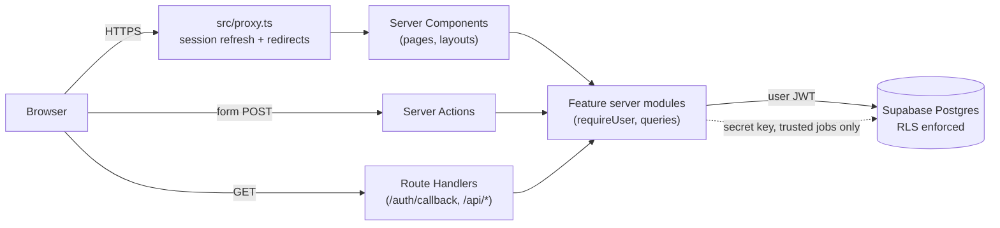
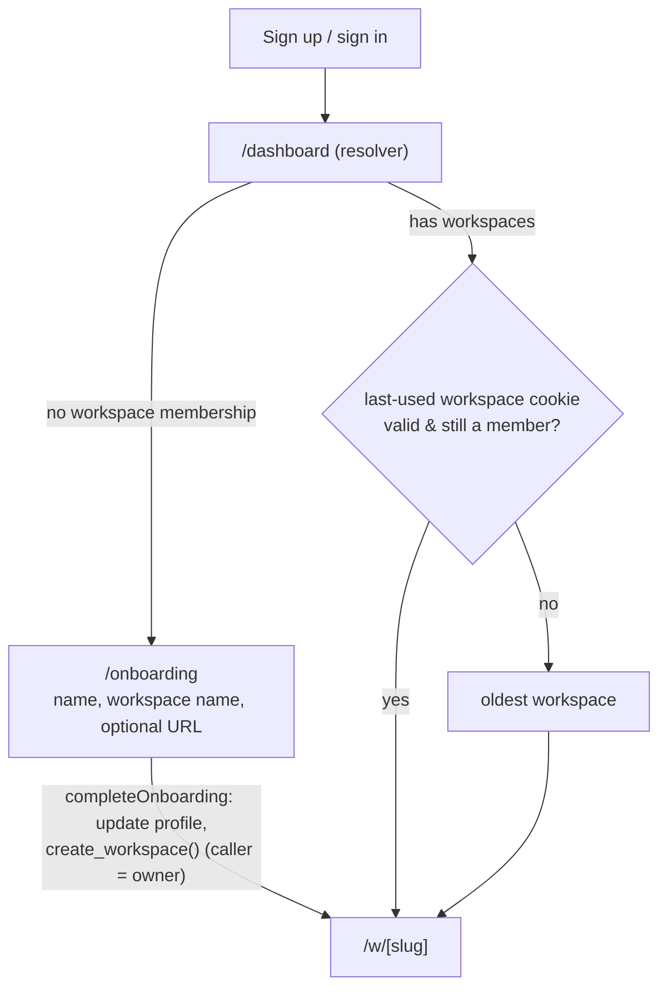
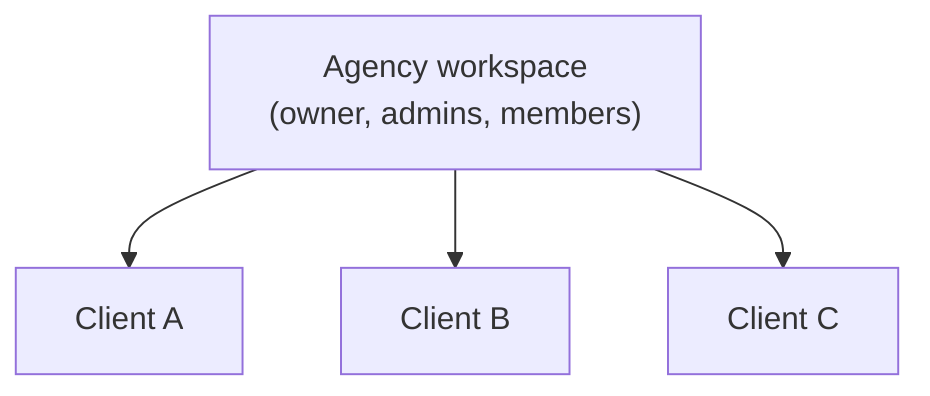
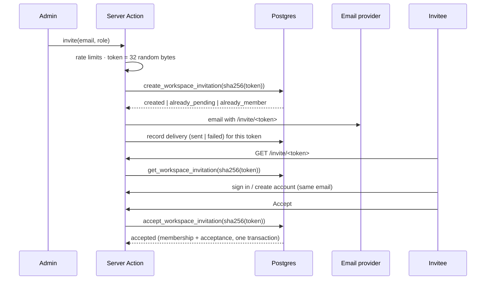

# Architecture

DreamFunnels is a funnel, website and lead-to-appointment platform for agencies and local-service
businesses. This document describes the system as it stands after Sprint 3 (client workspaces,
members, invitations and transactional email, on Sprint 2's agency → client tenancy and the
Sprint 0–1 foundation), the rules every feature must follow, and the decisions behind them. Keep
it current: an architectural change isn't done until this file says so.

## At a glance

| Concern         | Choice                                                                       |
| --------------- | ---------------------------------------------------------------------------- |
| App framework   | Next.js 16 (App Router, React 19, Turbopack), TypeScript strict              |
| Hosting         | Vercel (Node.js runtime)                                                     |
| Database & auth | Supabase: Postgres 17 + Auth, accessed via `@supabase/ssr`                   |
| Authorization   | Postgres Row Level Security (RLS) + server-side guards                       |
| Tenancy         | Workspaces: agencies, each with one level of client workspaces               |
| Authentication  | Supabase Auth, email + password, sessions in HTTP-only cookies               |
| Abuse control   | App-level rate limits (per IP and email, Postgres) + Turnstile CAPTCHA       |
| Email           | Transactional only: Resend (hosted) / Mailpit (local), behind an interface   |
| UI              | Tailwind CSS v4, shadcn/ui (Base UI primitives, incl. Toast), lucide         |
| Validation      | Zod 4 at every trust boundary (env, forms, actions)                          |
| Client state    | Zustand, only for ephemeral UI state; React context for app context          |
| Testing         | Vitest (unit, component, database/RLS on PGlite), Playwright (E2E)           |
| CI              | GitHub Actions: typecheck, lint, format, tests, build, E2E on local Supabase |
| Observability   | Structured JSON logs; Sentry- and PostHog-ready seams (no SDKs installed)    |

It's a **modular monolith**: one deployable Next.js app plus one Supabase project. No
microservices, queues or separate APIs until a real need forces one (see "Extension points").



## Repository layout

```
.github/workflows/
  ci.yml                     CI quality gates
  deploy-database.yml        Manual: migrate a hosted project, then verify its Auth settings
docs/                        Architecture, database and QA docs
e2e/                         Playwright specs (smoke: no backend; the rest need Supabase + Mailpit)
scripts/verify-hosted-auth.mts  npm run verify:hosted (hosted Auth settings check)
supabase/
  config.toml                Local stack config (auth settings, redirect URLs, ports)
  migrations/                Ordered SQL migrations: the schema's source of truth
  templates/                 Auth email templates (token_hash links that work on any device)
  tests/                     RLS / tenant-isolation tests (Vitest + PGlite)
src/
  app/                       Routes only: thin files that compose features
    (marketing)/             Public pages (landing)
    (auth)/                  login, signup, forgot-password, reset-password, invite/[token] (centered card)
    (app)/                   Signed-in area (layout: requireUser)
      dashboard/             Post-sign-in landing: redirects to onboarding or a workspace
      (setup)/               onboarding, workspaces/new (focused layout, no shell)
      w/[workspaceSlug]/     Workspace shell + dashboard home, clients (agencies),
                             settings (general, members, account)
    auth/callback/           Supabase email-link completion (confirm, recovery)
    api/health/              Liveness probe
  components/
    ui/                      shadcn/ui primitives (generated; edit sparingly) + toast.tsx
    layout/                  App shell, sidebar, nav, user menu, settings nav
    providers/app-context.tsx  Authenticated app context (user + current workspace)
    feedback/ forms/ brand/  Empty/error/loading states, form fields, logo
  config/                    Site metadata, the route map, workspace navigation
  features/<feature>/        Vertical slices (see below)
  lib/                       Cross-cutting infrastructure
    env/                     Validated configuration (schema, public, server; APP_ENV rules)
    supabase/                Client factories: server, client (browser), proxy, admin
    rate-limit/              rateLimit(policy, subject) and its stores (Postgres, memory)
    captcha/                 Turnstile verification (server) + constants shared with the widget
    email/                   Email transport: EmailProvider interface, Resend and Mailpit adapters
    timezones.ts             IANA time zones: canonical list, validation, readable labels
    countries.ts phone.ts request-ip.ts
    logger.ts monitoring.ts analytics.ts errors.ts action-result.ts run-action.ts
  stores/                    Global UI-only Zustand stores
  types/database.types.ts    Supabase-generated DB types
  instrumentation.ts         Server error hook (onRequestError)
  proxy.ts                   Next.js proxy (formerly "middleware")
```

### Feature slices

Each product capability lives in `src/features/<name>/` and owns its code end to end:

```
features/workspaces/
  schemas.ts        Zod schemas (shared by client and server)
  lib/              Pure logic, safe anywhere (e.g. role hierarchy)
  server/           `import "server-only"` data access and guards
  actions.ts        "use server" mutations (return ActionResult)
  components/       Feature UI
```

Rules:

- `app/` files stay thin: they read params, call a feature's guard/query, and render.
- A feature may import from `lib/`, `components/`, `config/` and other features' **public**
  modules (schemas, server guards). Avoid cycles; lift shared code into `lib/` when two features need it.
- Anything touching secrets, the database or the session goes in `server/` with
  `import "server-only"`, which makes a client import fail the build.

Current slices:

| Slice         | Owns                                                                                                |
| ------------- | --------------------------------------------------------------------------------------------------- |
| `auth`        | Sign up/in/out, password reset and change, session guards, error mapping, routing, abuse protection |
| `account`     | The user's profile: name, phone, time zone, locale                                                  |
| `onboarding`  | First-run setup: name + first workspace (seeded with the browser's time zone and locale)            |
| `workspaces`  | Workspaces, access guards (incl. agency access), slugs, switcher, settings, business profile,       |
|               | clients (list, "Add client"), members (list, role changes, removal)                                 |
| `invitations` | Invitations: tokens, invite/resend/revoke, the public invitation page, acceptance                   |
| `email`       | Transactional email: version-controlled templates and `sendTransactionalEmail()`                    |

Future slices plug in the same way: `features/funnels`, `features/pages`, `features/publishing`,
`features/domains`, `features/forms`, `features/contacts`,
`features/automations`, `features/ai`, `features/billing`. A new module also gets an entry in
`src/config/navigation.ts` (it shows as "Soon" until it has an `href`).

## Authentication

Email + password on Supabase Auth. Every auth mutation is a Server Action in
`features/auth/actions.ts`, so credentials only ever travel browser → our server → Supabase, and
session cookies are written on our own response.

| Flow                      | Route(s)                             | How it works                                                                                                                                                                                                                                                                                                                |
| ------------------------- | ------------------------------------ | --------------------------------------------------------------------------------------------------------------------------------------------------------------------------------------------------------------------------------------------------------------------------------------------------------------------------- |
| Sign up                   | `/signup`                            | Rate limit and CAPTCHA, then `auth.signUp`. With email confirmation **off** (local) there's a session at once → `/onboarding`. With it **on** (staging, production) the form shows "check your email" (+ resend, rate-limited); the link goes through `/auth/callback` → `/dashboard`.                                      |
| Sign in                   | `/login`                             | Rate limit, then `auth.signInWithPassword` → safe `?next=` or `/dashboard`. Wrong email and wrong password get the same message.                                                                                                                                                                                            |
| Sign out                  | user menu, setup header              | `auth.signOut({ scope: "local" })`: this browser only; other devices stay signed in.                                                                                                                                                                                                                                        |
| Forgot password           | `/forgot-password`                   | Rate limit and CAPTCHA, then `auth.resetPasswordForEmail`. The UI always says "if an account exists", so it can't be used to discover accounts.                                                                                                                                                                             |
| Reset password            | `/auth/callback` → `/reset-password` | The emailed link signs the user in. The page and action only accept a session created by an **email link in the last hour**: JWT `amr` method `recovery` (PKCE link), `otp` (token_hash link; Supabase records every `/verify` as an OTP) or `magiclink` (`lib/recovery.ts`). Any other session must use "change password". |
| Change password           | `/w/[slug]/settings/account`         | Requires the current password, checked on a detached client (`createDetachedClient`) so the user's own session isn't replaced; the extra session is ended immediately.                                                                                                                                                      |
| After any password change |                                      | `auth.signOut({ scope: "others" })` revokes the user's other sessions, so a stolen session can't outlive the password.                                                                                                                                                                                                      |

Details:

- **Password policy** (`features/auth/schemas.ts`): 8+ characters, at most 72 **bytes** (bcrypt's
  limit, so multi-byte characters count properly), not only spaces, never trimmed. No composition
  rules (NIST SP 800-63B). Supabase enforces its own minimum too (`minimum_password_length = 8`).
- **Errors** (`features/auth/lib/auth-errors.ts`) map Supabase error codes to user messages and to
  the right form field ("email already registered" → email, `weak_password` → password). Rate limits
  become `RATE_LIMITED`. Anything unknown is a generic `INTERNAL` error. Logs carry codes, never
  emails or passwords.
- **Email links**: `/auth/callback` handles the PKCE `?code=` link (default templates; same browser
  only) and the `?token_hash=&type=` link (`supabase/templates/*`; any device). A failed recovery
  link goes back to `/forgot-password`, anything else to `/login`, each with a recoverable message.
  Every `?next=` passes through `getSafeRedirectPath` (no open redirects).
- **Email confirmation**: off in local/CI config (`supabase/config.toml`) so the E2E journey and
  local dev land straight in onboarding; **required in staging and production**. The code handles
  both. Two guards stop a hosted project from silently running without it: `npm run verify:hosted`
  (also run by the deploy-database workflow) fails when Supabase reports `mailer_autoconfirm`, and in
  a hosted `APP_ENV` a sign-up that returns a session straight away logs
  `security.email_confirmation_disabled` at error level.
- Three client factories in `src/lib/supabase/`, plus one helper:
  - `server.ts#createClient`: Server Components, Actions and Route Handlers, acting **as the user** (RLS applies).
  - `server.ts#createDetachedClient`: user-scoped but not bound to request cookies (credential checks).
  - `client.ts`: browser (future realtime/uploads), acting as the user (RLS applies).
  - `admin.ts`: secret key, **bypasses RLS**, server-only, for trusted jobs/webhooks and the auth
    rate limiter's counters (a no-user path). ESLint blocks raw `createClient` imports elsewhere.

## Session handling

- `@supabase/ssr` keeps the session (access + refresh token) in HTTP-only, `SameSite=Lax` cookies,
  so it survives reloads and browser restarts until the refresh token is revoked or expires.
- `src/proxy.ts` runs on every request. `updateSession` calls `auth.getClaims()`, which verifies the
  JWT and refreshes an expired access token, writing the new cookies on the response. Server
  Components therefore always see a fresh token (they can't write cookies themselves).
- Server code identifies the user with `getCurrentUser()`/`requireUser()` (`features/auth/server/session.ts`),
  which use verified claims, never the unverified `getSession()`. Memoised per request.
- **Invalid or expired sessions**: a revoked, expired or tampered session fails verification;
  Supabase clears the cookies and the user is treated as signed out. If the request carried a
  session cookie, the proxy adds `reason=session_expired` to the login redirect and the login page
  says "Your session has ended". An Auth outage fails closed (signed out), never open.
- The proxy only redirects `GET`/`HEAD` navigations. A Server Action is a `POST` to the current page;
  redirecting it would replay the POST against `/login`, so it goes through and the action's own
  `requireUser()` answers.

## Onboarding flow



- "Needs onboarding" is simply "has no workspace membership"; no flag is stored. `/onboarding`
  redirects away once a workspace exists, and `/dashboard` sends users without one to onboarding.
- `completeOnboarding` is idempotent: a double submit or a second tab opens the existing workspace
  instead of creating another.
- The URL is optional. Left blank, `create_workspace()` generates it from the name
  ("Café Münster & Co." → `cafe-munster-co`, plus a random suffix if short, reserved or taken). The
  form previews the result with the same algorithm (`features/workspaces/lib/slug.ts`).
- More workspaces: switcher → "Create workspace" → `/workspaces/new`.

## Authorization

**Principle: never trust the client, and never trust a single layer.** There are four layers, each
sufficient on its own:

| Layer            | Where                                                         | What it does                                                                |
| ---------------- | ------------------------------------------------------------- | --------------------------------------------------------------------------- |
| 1. Proxy         | `src/proxy.ts` (`getAuthRedirect`)                            | UX only: fast redirects to/from `/login`. Assume it can be bypassed.        |
| 2. Session guard | `requireUser()`                                               | Verifies the JWT server-side in layouts, pages, actions and data functions. |
| 3. Tenant guard  | `requireWorkspaceMember(slug)` / `requireWorkspaceAccess(id)` | Loads the caller's effective role through RLS and applies the role rule.    |
| 4. Database      | RLS policies + column grants + constraints                    | The final word. Data outside the caller's workspaces is invisible.          |

The tenant guards (`features/workspaces/server/queries.ts`) share one pure decision,
`authorizeWorkspaceAccess(membership, minRole)` in `lib/access.ts` (unit-tested):

- **Pages and layouts** use `requireWorkspaceMember(slug, minRole)`. Non-members get `notFound()`,
  deliberately identical to "doesn't exist", so workspace existence never leaks. Members below the
  required role get a `FORBIDDEN` error.
- **Server Actions** use `requireWorkspaceAccess(workspaceId, minRole)`. It throws `AppError`s
  (`NOT_FOUND` / `FORBIDDEN`) that the form can display. The id comes from the form, so it's only a
  reference: access is always re-read through RLS, and the write itself runs under RLS again.
- Role rules mirror RLS: `canManageWorkspace(role)` (admin+) gates workspace settings in the UI,
  the action (`requireWorkspaceAccess(id, "admin")`) and the `workspaces: admins can update` policy.
- The role the guards see is the **effective** role, read from the `viewer_role` computed field
  (`public.viewer_role(workspaces)`): the caller's own membership, or the role their agency
  owner/admin membership carries into the agency's clients (see "Agency → client hierarchy"). So
  "member" in `requireWorkspaceMember` means "has access", however it was granted.

Rules for feature code:

1. Every page, action and route handler that touches user data calls `requireUser()` or a guard
   built on it, **next to the data access**. Layout checks alone are insufficient because
   layouts don't re-run on client navigation.
2. Tenant-scoped routes live under `/w/[workspaceSlug]/…` and start with `requireWorkspaceMember`.
   Actions that take a workspace id start with `requireWorkspaceAccess`.
3. Query with the user's client (`lib/supabase/server.ts`) so RLS applies. Pass `workspace_id`
   explicitly for clarity and index use; RLS is what enforces it.
4. The admin client is for code paths with no user (webhooks, cron, provisioning). It must scope
   every query by `workspace_id` by hand and must never serve a user request.
5. UI hiding (e.g. read-only settings for members) is cosmetic; the server and DB decide.
6. Never authorize from the client app context (below): it's for rendering only.

## Multi-tenancy

- **Workspace = tenant.** Users belong to many workspaces via `workspace_members`, with the role
  `member < admin < owner`. A workspace is an **agency** (top level) or a **client** of one agency.
- Every tenant-owned table carries `workspace_id` plus RLS policies that call the `private.*`
  helpers. `docs/DATABASE.md` has the copy-paste template.
- Signup creates only the profile. The first workspace is created in **onboarding**, where the
  user names it (Sprint 1; Sprint 0 auto-provisioned a "personal workspace", see decision 13).
- Workspace creation and membership inserts go only through trusted SQL functions
  (`create_workspace()`, `create_client_workspace()`, `accept_workspace_invitation()`), so no
  agency is ever ownerless and no one is added without consent.

### Workspace context and switching

- **The URL is the source of truth**: `/w/[slug]/…`. Links are shareable, each tab can hold a
  different workspace, and there's no stale server-side "current workspace".
- **Server**: `requireWorkspaceMember(slug)` returns `{ id, name, slug, role }`, memoised per
  request, so any page, layout or data function under `/w/[slug]` gets the workspace id cheaply.
- **Client**: the workspace layout fills `AppContextProvider` (`components/providers/app-context.tsx`)
  with the verified user, current workspace and the user's workspace list. Client Components read
  `useAppContext()`, `useCurrentWorkspace()` (e.g. `.id`) and `useCurrentUser()`.
- **Switching** is navigation: the switcher links to `/w/<other-slug>`. It lists the user's
  agency-level workspaces, then at most 20 client workspaces by name (`listSwitcherWorkspaces`),
  plus "View all clients" when there are more; an agency with hundreds of clients never loads
  them all per page. The current client is always listed, and a client shows "Client of
  <agency>" when the viewer can see that agency.
- **Remembering**: `RememberWorkspace` (in the workspace layout) writes a `df_last_workspace`
  cookie, `<userId>:<slug>`, whenever a workspace is shown. `/dashboard` reopens it after sign-in if
  the user can still open it (`resolveDefaultWorkspace`), else the oldest workspace. It's a preference,
  never an authorization input: it's scoped to the user, validated, and ignored for anyone else. It's
  written by the page rather than the proxy because the proxy also sees link prefetches.
- **Team members** join by invitation (see "Members and invitations").

### Agency → client hierarchy

Agencies manage many client businesses, so a workspace is either an **agency** or a **client**
of exactly one agency. It's one level deep on purpose: no organisations table, no second
membership model, no recursive trees.



| Person                   | Agency  | Its clients           | Sibling clients / other agencies |
| ------------------------ | ------- | --------------------- | -------------------------------- |
| Agency **owner**         | owner   | **owner** (inherited) | nothing                          |
| Agency **admin**         | admin   | **admin** (inherited) | nothing                          |
| Agency **member**        | member  | nothing, unless added | nothing                          |
| Client member (any role) | nothing | their own client only | nothing                          |
| Someone with both        | direct  | the higher of the two | —                                |

- Every self-serve workspace (onboarding, "Create workspace") is an agency: a single business is
  simply an agency without clients. All pre-Sprint 2 workspaces became agencies. The UI doesn't
  call them "agencies"; that's a data-model term.
- The rule lives in one place, `private.user_workspace_ids()` (which workspaces) and
  `private.workspace_role()` (which role), so every existing and future policy applies it.
  Details, invariants and delete behaviour: `docs/DATABASE.md` "Agency → client hierarchy".
- Nobody can change a workspace's type or parent through the API (no column grants). Moving
  clients between agencies and detaching them remain future trusted functions.
- Client members can't see their agency, and so can't see agency staff's profiles either. Features
  that show "managed by" or agency staff in a client need an explicit, narrow read path.

### Client workspaces

Agency owners and admins manage clients at `/w/<agency>/clients` ("Clients" in the sidebar, shown
to them only; agency members get an explanation, clients a 404):

- **List**: name, status (Active = has direct members, Invitation pending, No members yet),
  primary contact, time zone, member count and created date; `?q=` search and 25 per page in the
  URL. One query per page: the counts are PostgREST computed fields (`member_count`,
  `pending_invitation_count`), not a query per client.
- **Add client** (`/clients/new`): one focused form (business, address, workspace name and URL,
  and optionally who to invite) with a "What happens next" summary, rather than a wizard: it's
  short, and the summary states the consequences before anything happens. The action calls
  `create_client_workspace()`, which checks that the caller owns or administers the agency (the
  id from the form is only a reference) and writes the client and its business profile in one
  transaction. The client starts empty: no data, no direct members (agency owners and admins
  reach it by inheritance), no credentials. Snapshots will deploy into it later.
- The optional invitation runs **after** the client exists: if it fails (rate limit, email
  outage), the client is still created and the success screen says exactly what happened.
- Client names are unique within an agency (case-insensitive), which also makes a double submit
  fail instead of creating two clients. Slugs stay globally unique, generated like
  `create_workspace()`'s.
- Clients use the same app shell, settings and members pages as agencies; only the data differs.

## Members and invitations

`/w/<slug>/settings/members` lists a workspace's **direct** members (name, email, role, joined)
and, for owners and admins, its open invitations. On a client viewed by agency staff, a note says
the agency's owners and admins can also manage it (they aren't listed: their access is inherited).

### Who can do what

| Action                                | Member | Admin                      | Owner                          |
| ------------------------------------- | ------ | -------------------------- | ------------------------------ |
| See members                           | yes    | yes                        | yes                            |
| See, send, resend, revoke invitations | no     | yes (member or admin role) | yes (member or admin role)     |
| Change a role (member ⇄ admin)        | no     | non-owners                 | anyone, incl. demoting owners¹ |
| Remove someone                        | no     | non-owners                 | anyone¹                        |
| Grant ownership                       | no     | no                         | not in this release²           |
| Add client workspaces (agencies)      | no     | yes                        | yes                            |
| Act on your own row (role, removal)   | no     | no                         | no                             |

¹ Never the last owner: the `protect_last_owner` trigger refuses it and the UI explains why.
² Invitations can't grant `owner` (a CHECK constraint), and the role picker offers member and
admin only. An ownership-transfer flow is future work. "Admin" in an agency means admin of every
client too, which the role picker says in so many words.

`memberActionsFor()` (`features/workspaces/lib/members.ts`) is the pure rule the UI and the
actions share; RLS on `workspace_members` and the trigger enforce it again underneath.
Removing someone deletes the membership only: never their account or their other workspaces.

### Invitation lifecycle



- **Tokens** are 256 random bits (`crypto.randomBytes`), base64url, only in the emailed link.
  The database stores their SHA-256 (hex), looked up through a unique index. A fast hash is right
  for a full-entropy secret; lookups happen in Postgres, so there's no timing side channel in app
  code. Tokens never appear in our logs (`onRequestError` redacts `/invite/<token>`), analytics,
  error messages or the provider's idempotency key.
- **One open invitation per workspace and address** (partial unique index). Inviting an address
  with a pending invitation returns `already_pending`, and the dialog offers Resend or Cancel;
  an expired one is reissued on the same row. Double clicks and concurrent requests end with one
  row (tested against the real database).
- **Expiry** is 7 days, a database timestamp checked at acceptance. **Resend** rotates the token
  (the old link stops working), resets the expiry and sends again. **Revoke** marks the row
  revoked (kept for the record); the link then shows "cancelled".
- **The invitation page** (`/invite/[token]`, public) is rendered per request
  (`force-dynamic`; production sends `private, no-cache, no-store`), sends no Referer, isn't
  indexed, and shows nothing for malformed, unknown or random tokens. States: pending (sign in /
  create account), wrong account, expired, cancelled, already used (or "you've joined"), invalid.
- **Acceptance** needs the token _and_ a signed-in user whose **verified** email
  (`auth.users.email_confirmed_at`) equals the invited address. The function locks the
  invitation row, re-checks every condition, inserts the membership (`on conflict do nothing`)
  and marks it accepted in one transaction, so concurrent accepts produce one membership. The
  workspace and role come from the invitation, never from the request.
- **Wrong account**: the page says whom it was sent to and offers "Sign out and continue", which
  signs out this browser only and returns to the invitation. Nothing switches silently.
- **New accounts**: "Create an account" opens `/signup?invite=<token>` with the email fixed to
  the invited address (re-checked by the action). Without email confirmation (local) sign-up
  lands back on the invitation. With it (staging, production) the confirmation template always
  returns to `/dashboard`, so sign-up leaves the token in an httpOnly, 24-hour
  `df_pending_invitation` cookie that `/auth/callback` turns into a redirect back to the
  invitation (and deletes). The cookie is only a reference: the page and the acceptance
  re-validate everything. Confirming on another device just means opening the link again.
  Accounts made this way skip onboarding: the accept form asks for their name instead.

### Audit log

Membership and invitation changes are security-sensitive, so a minimal append-only
`private.audit_log` records them: a trigger on `workspace_members` (added, role changed, removed,
left) and the invitation and client functions (invited, resent, revoked, accepted, client
created), each with the actor (`auth.uid()`), workspace, target and a small JSON payload. It's
not exposed through the Data API and nobody can update or delete rows. There's no UI yet.

## Transactional email

Business code sends email by calling a feature function (`sendInvitationEmail()`), never a
provider API:

```
features/invitations  sendInvitationEmail(invitation)
        ↓
features/email        sendTransactionalEmail({ to, template, variables, metadata })
                      validates variables (Zod), renders the template, logs the outcome
        ↓
lib/email             EmailProvider.send(message) → { ok, messageId } | { ok: false, reason }
                      createResendProvider (hosted) · createMailpitProvider (local, CI)
```

- **Templates** are version-controlled code (`features/email/templates/`): a typed variables
  schema and a renderer producing subject, HTML and text. Every interpolated value is
  HTML-escaped; links must be http(s). A missing or invalid variable fails the send (and is
  logged by path) instead of mailing "undefined". No tenant-authored HTML exists yet.
- **Providers never throw for delivery problems**: they return `rejected`, `rate_limited`,
  `unavailable` or `misconfigured`, keeping the provider's error name but never its message
  (which can echo addresses). A 10-second timeout bounds every send; there's no automatic retry
  yet (people can resend). Adding a provider is one adapter file.
- **Resend over its REST API with `fetch`**: one POST didn't justify an SDK, and it keeps provider
  types out of the app. Each send carries an `Idempotency-Key` derived from the invitation and
  its token hash, so a retried request can't send twice.
- **Mailpit** (in the local Supabase stack) is the default when `EMAIL_PROVIDER` isn't `resend`:
  mail is captured at http://127.0.0.1:54324 and E2E tests read it back through its API. CI never
  talks to a third-party provider. Tests use an in-memory fake (`src/test/fake-email.ts`) that no
  environment variable can select.
- **Sending happens after the database commit**, outside any transaction. If the provider fails,
  the invitation stays valid, its row records `delivery_status = failed`, the list shows "Email
  not delivered", and the UI never says "sent" unless the provider accepted the message. A queue
  with retries belongs with the future jobs infrastructure.
- **Links** are built from `NEXT_PUBLIC_APP_URL`, never from request headers.
- **Configuration**: see "Configuration and secrets". Staging and production builds fail unless
  `EMAIL_PROVIDER=resend`, `RESEND_API_KEY` and `EMAIL_FROM_ADDRESS` are set, and production
  rejects Resend's `@resend.dev` test sender.

## Data access and mutations

- **Reads**: async Server Components call feature `server/` functions, wrapped in React `cache()`
  so repeated calls within a request are free.
- **Writes**: Server Actions. Each action validates input with Zod, authenticates and authorizes,
  performs the write, and returns an `ActionResult<T>` (`{ ok: true, data }` or
  `{ ok: false, error: { code, message, fieldErrors? } }`). Wrap the body in
  `runAction(name, fn)` for uniform error handling. An `AppError` may carry `fieldErrors`
  (e.g. a taken URL from a unique violation), which `runAction` passes to the form.
- After a write, actions call `refresh()` (from `next/cache`) when the shell shows the changed
  data, so the updated UI arrives in the same response. When the write changes the URL itself
  (workspace slug), the client navigates to the new URL instead.
- Database constraint errors are translated once per feature (e.g.
  `features/workspaces/lib/write-errors.ts`), reading only the SQLSTATE and constraint name.

## Forms and feedback

- Forms are Client Components using `useActionState` with a Server Action. Validation happens on
  the server (the Zod schema is the authority); fields show `fieldErrors` next to the input, and a
  form-level message appears only when no field is to blame.
- `FormField` wires label, hint and error to the control (`aria-invalid`, `aria-describedby`).
  `SubmitButton` disables itself and shows progress while pending.
- React resets uncontrolled inputs after every action, so fields worth keeping after an error
  (emails, names) are controlled. Password fields stay uncontrolled on purpose, so they're cleared.
- Success side effects (toast, navigation, analytics) run in the `useActionState` callback, once
  per result, not in effects.
- Toasts: `toast.success/error/info()` from `components/ui/toast.tsx`, built on Base UI's Toast
  (already a dependency) with one `<Toaster />` in the root layout. They survive client navigation.
- Loading: route `loading.tsx` skeletons (workspace, settings) or a spinner (`PageLoader`).
  Errors: `error.tsx` per area; the workspace one keeps the shell.
- Route Handlers exist only for things that must be URLs: auth callbacks, webhooks, health, and
  (later) public endpoints.
- Prefer server-side operations for anything sensitive. The browser Supabase client is for
  realtime and direct-to-storage uploads only.

## Time zones, business profile and preferences

- **Time zones are IANA ids** ("America/Chicago"), never offsets like `-5`, which lose daylight
  saving. Workspaces have one (required, default `UTC`): it drives appointment times, reminders,
  booking hours and reports. Profiles have one for a person's own notifications.
- The database checks the shape and asks Postgres whether the zone exists
  (`private.is_valid_timezone`, rejecting offsets, POSIX strings, `Etc/GMT±N` and wrong
  capitalisation). The app offers a static list of 418 canonical ids (`lib/timezone-ids.ts`: ICU's
  list with CLDR's legacy names mapped to current IANA ones, so `Asia/Calcutta` becomes
  `Asia/Kolkata`), and `canonicalTimezone()` maps whatever a browser reports onto it.
- Labels ("Central Time — Chicago", with "America/Chicago · GMT-6" underneath) come from Intl. The
  server builds the option lists and passes them down, so browsers with different ICU data can't
  cause hydration mismatches. Options sort west to east by the current offset.
- New workspaces and profiles start in the **browser's** time zone and locale (hidden hints in
  onboarding and "Create workspace", validated on the server; anything unusable falls back to UTC /
  en-US). Both are editable in settings.
- **Business profile** (workspace settings): business name (customer-facing; the workspace name
  stays the internal label), email, phone, structured address, logo URL and two brand colours.
  Phones are stored in E.164 (`+15125550100`, what SMS providers need); people type any common
  format but must include the country code. Addresses are separate columns (line 1–2, city,
  region, postal code, ISO country) because messaging compliance, schema.org data and booking
  need the parts. Colours are named columns (`brand_primary_color`, `brand_secondary_color`),
  not a JSON blob. Logo upload waits for Storage; today it's an https URL.
- **Profile preferences** (account settings): mobile phone, time zone, and a locale for date and
  number formatting (the UI itself is English).
- The pickers are `components/forms/searchable-select.tsx`, a Base UI Combobox: type to filter
  (every word must match label, IANA id or keywords, accent-insensitive), arrows, Enter, Escape.

## Error handling

- `AppError(code, message, { cause, expose, context, fieldErrors })` with codes `UNAUTHENTICATED`,
  `FORBIDDEN`, `NOT_FOUND`, `VALIDATION`, `CONFLICT`, `RATE_LIMITED` and `INTERNAL`. Only
  `expose: true` messages reach users; everything else maps to a safe generic message
  (`toPublicError`).
- `runAction` turns expected `AppError`s into typed failures (logged at `warn`) and reports
  everything else. Next.js control-flow errors (`redirect`, `notFound`) pass through untouched.
- UI boundaries:
  - `app/error.tsx` covers public routes.
  - `app/(app)/error.tsx` covers the signed-in area outside a workspace.
  - `app/(app)/w/[workspaceSlug]/error.tsx` covers workspace pages and keeps the shell.
  - `app/global-error.tsx` covers root-layout failures.
  - `not-found.tsx` renders at the root; `app/(app)/w/not-found.tsx` catches `notFound()` from the
    workspace layout (non-member or unknown slug) and says the same thing in both cases.
- Loading: route-level `loading.tsx` skeletons, and `SubmitButton` for pending form state.

## Logging and monitoring

- `src/lib/logger.ts`: dependency-free structured logger. In production it writes JSON lines
  (which Vercel ingests), in development readable lines, and in tests it's silent. Messages are
  dot-namespaced events (`auth.callback_failed`), details go in the context object, and
  sensitive keys (password, token, secret, cookie, authorization, api key…) are redacted
  recursively.
- `src/lib/monitoring.ts#reportError` is the single sink for unexpected errors. It's called from
  `runAction`, `instrumentation.ts#onRequestError` (Server Components, route handlers, actions,
  proxy) and the client error boundaries (client-originated errors only, so they're not double-reported).
- **Sentry-ready**: install `@sentry/nextjs`, initialise it in `instrumentation.ts`
  `register()` and a new `src/instrumentation-client.ts`, then call
  `setErrorReporter({ captureException: Sentry.captureException })`. The env vars are
  already in the contract.
- **PostHog-ready**: `track()` in `src/lib/analytics.ts` accepts only events declared in the typed
  `AnalyticsEvents` catalog. Install `posthog-js`, initialise it in `instrumentation-client.ts` when
  `NEXT_PUBLIC_POSTHOG_KEY` is set, and call `setAnalyticsProvider`. **Never send PII** in event
  properties.

## Configuration and secrets

- `src/lib/env/schema.ts` is the typed contract; `.env.example` documents it.
  - `public.ts` holds the browser-safe values (NEXT_PUBLIC_*, listed literally so Next can inline them).
  - `server.ts` holds server-only values, guarded by `server-only`.
- `next.config.ts` validates both at build and dev start, so a missing variable fails the Vercel
  deploy instead of a production request. Errors name keys and never print values.
- Secrets live only in `.env.local` (git-ignored) and in Vercel/GitHub secrets. CI uses non-secret
  placeholders.
- `APP_ENV` (`local` | `staging` | `production`, default `local`) says where a deployment runs.
  `parseDeploymentEnv` (called by `next.config.ts`) fails a staging or production build that is
  missing `SUPABASE_SECRET_KEY`, the Turnstile keys or the email settings (`EMAIL_PROVIDER=resend`,
  `RESEND_API_KEY`, `EMAIL_FROM_ADDRESS`), uses http or a loopback Supabase URL, or (production)
  uses Cloudflare's test keys or Resend's `@resend.dev` sender. A Vercel deployment (`VERCEL_ENV` production or
  preview) can't be `local`. Errors list every problem at once, by key name only.

## State management

1. **Server state** (anything from the DB) stays on the server: fetched in RSC and mutated by
   actions, with `revalidatePath`/`updateTag` on writes. Don't copy it into client stores.
   The app context (user + current workspace) is server data handed down read-only for rendering;
   it's refreshed by re-rendering the layout (`refresh()`), never mutated on the client.
2. **URL state** (workspace, filters, tabs) lives in the path or search params.
3. **Local component state**: `useState`/`useReducer`.
4. **Shared ephemeral UI state**: Zustand. Module-level stores (like `stores/ui-store.ts`) may hold
   only non-user-specific UI state. Stores holding user or document data (e.g. the funnel
   editor's document) must be created per mount with `createStore` plus React context, so SSR
   requests never share state.

## Security baseline

- RLS on every table with least-privilege grants: `anon` has none, and `authenticated` has
  only the needed verbs and columns (see `docs/DATABASE.md`).
- `server-only` on every module that holds secrets or talks to the DB as a server.
- Open-redirect protection on all `next` parameters.
- Security headers on every response (`nosniff`, `DENY` framing, strict referrer and permissions
  policy); `X-Powered-By` is off.
- Auth-cookie responses are marked uncacheable (from `@supabase/ssr`), and logs strip query
  strings from error paths.
- Authentication hardening (Sprint 1):
  - Password reset only in a session created by an email link within the last hour (JWT `amr`),
    so a stolen password session can't set a new password without the current one.
  - Change password requires the current password; every password change signs out other sessions.
  - Same message for unknown email and wrong password; "if an account exists" on password reset.
  - Sign-out is per device; expired, revoked or tampered sessions are treated as signed out.
  - Credentials only pass through Server Actions (origin-checked by Next); never logged.
- Tenant isolation is tested at three levels: RLS on PGlite, pure guard unit tests, and E2E
  (another user's workspace URL renders "Workspace not found").
- **Rate limiting and CAPTCHA** on the public auth forms: see "Abuse protection" below.
- **PostgREST clock bug** (PostgREST#5196): versions before v16.3 / v14.18 read the time from a
  cache that can be badly stale, so they sporadically reject a freshly minted token as "JWT issued
  at future" (PGRST303), which hit new users right after sign-up. Local and CI stacks pin the fixed
  v16.3 (`supabase/.temp/rest-version`). For hosted projects, which report the same error, the
  server client (`lib/supabase/postgrest-retry.ts`) retries such a request twice (after 0.2s and
  1s); the JWT is checked before any query runs, so this is safe for writes. Remove both once every
  environment runs a fixed PostgREST.
- **JWT verification**: `getClaims()` verifies tokens locally against the project's JWKS when the
  project signs with an asymmetric key, and falls back to asking Auth when it only has the legacy
  HS256 secret. Hosted projects must use asymmetric JWT signing keys (checked by
  `npm run verify:hosted`; see "Deployment").
- Invitations (Sprint 3): hashed single-use tokens, acceptance bound to the verified invited
  email, uncached and unindexed invitation pages, rate-limited sending, and an append-only audit
  log of membership changes (see "Members and invitations").
- Not yet (tracked): Content-Security-Policy with nonces, MFA, email change, account deletion,
  an audit log UI, Supabase-native CAPTCHA (see below).

## Abuse protection (rate limiting and CAPTCHA)

Supabase Auth sees every request from our server's IP, so its per-IP limits can't tell our
visitors apart. The public auth actions therefore protect themselves before calling Supabase
(`features/auth/server/abuse-protection.ts`), in this order: per-IP limit, CAPTCHA (where
required), per-email limit. Counting the email only after the CAPTCHA means nobody can spend a
stranger's budget for free and lock them out of signing up or resetting a password:

| Action                          | Rate limits (per window)                   | CAPTCHA |
| ------------------------------- | ------------------------------------------ | ------- |
| Sign in                         | 30 / 10 min per IP · 10 / 15 min per email | no      |
| Sign up, resend confirmation    | 10 / hour per IP · 5 / hour per email      | sign-up |
| Request a password reset        | 10 / hour per IP · 5 / hour per email      | yes     |
| Change password (current check) | unchanged: Supabase's own sign-in limits   | no      |

- **`rateLimit(policy, subject)`** (`lib/rate-limit`) is provider-agnostic: a policy is
  `{ name, limit, windowSeconds }`, the result says `allowed`, `remaining`, `resetAt` and
  `retryAfterSeconds`. Storage is a `RateLimitStore` with one method. Change limits in
  `AUTH_RATE_LIMITS`; add a backend by writing a store.
- **Backend**: Postgres fixed-window counters (`private.rate_limit_counters` through the
  service-role-only `public.rate_limit_hit()`), shared by every server instance, with no new vendor
  or package. Without `SUPABASE_SECRET_KEY` (local only) counters live in process memory. A Redis
  store (e.g. Upstash over its REST API) can replace it if auth traffic ever makes these writes
  matter.
- Keys hold a SHA-256 prefix of the subject, never the email or IP. IPv6 clients count per /64.
  Unknown IPs skip the per-IP check (per-email still applies). If the store fails, requests are let
  through and the failure is reported (`security.rate_limit_unavailable`): a limiter outage must
  not lock everyone out.
- **Client IP** comes from `X-Forwarded-For`, which Vercel overwrites with the real client
  address. Behind another proxy, make sure it does the same, or per-IP limits become advisory.
- **CAPTCHA** is Cloudflare Turnstile, verified in our Server Action: the widget
  (`components/forms/turnstile-widget.tsx`) writes a token into the form, and the action sends it to
  Cloudflare's `siteverify` with the secret and the client IP. It must succeed **for the expected
  action** (`signup` / `password_reset`), so a token can't be replayed on another form. Missing,
  rejected or unverifiable tokens (Cloudflare unreachable: fails closed) get one generic message,
  and logs carry only the reason and Cloudflare's error codes. The submit button waits for a token.
- **Locally and in CI** the CAPTCHA is off when both Turnstile keys are unset (logged once as
  `security.captcha_disabled`), so tests never call Cloudflare. The verifier is unit-tested against a
  fake `siteverify`. Staging and production builds fail without the keys, and production rejects
  Cloudflare's test keys.
- **Direct API calls**: the publishable key lets anyone call Supabase Auth without our app. Those
  requests carry the caller's real IP, so Supabase's own per-IP limits (and email-sending limits)
  apply to them. Supabase's native CAPTCHA would also cover that path, but it applies to every
  password sign-in too (including the password re-check before a password change), so it's a
  deliberate later decision, not part of this sprint.
- Blocked attempts log `security.rate_limit_blocked` with the policy name only.
- **Signed-in actions** use the same limiter. Every invitation email (new or resent) spends from
  three budgets, checked before anything is written (`features/invitations/server/rate-limits.ts`):
  30 per hour per sender, 100 per day per workspace, and 5 per hour per recipient address across
  all workspaces, so no inbox gets flooded. Adding clients is limited to 50 per hour per person.
  Accepting isn't limited: tokens are 256-bit and unguessable.

## Deployment

### Environments

| Environment | Runs where                       | Supabase                           | `APP_ENV`    |
| ----------- | -------------------------------- | ---------------------------------- | ------------ |
| Local       | `npm run dev`, tests, CI         | local stack (`npm run db:start`)   | `local`      |
| Staging     | Vercel (Preview or a custom env) | its **own** project (`staging`)    | `staging`    |
| Production  | Vercel Production                | its **own** project (`production`) | `production` |

Never point two environments at one Supabase project: data, users, keys and rate-limit counters
must stay separate. Staging mirrors production's settings (confirmation on, asymmetric keys, real
Turnstile widget for its hostname, or Cloudflare's always-pass test keys if preferred).

### Setting up an environment (staging first, then production)

1. **Supabase**: create the project. In Auth settings:
   - URL Configuration: Site URL = the environment's `NEXT_PUBLIC_APP_URL`; add
     `<APP_URL>/auth/callback` to the redirect allow-list.
   - Email provider: **Confirm email ON**, minimum password length 8 (optionally leaked-password
     protection on paid plans).
   - Email templates: paste `supabase/templates/confirmation.html` and `recovery.html` (token_hash
     links that work across devices) and configure custom SMTP (the default sender only emails the
     project team).
   - **JWT keys**: Project Settings → JWT Keys → migrate to JWT signing keys and rotate so tokens
     are signed with the asymmetric (ECC P-256) key; keep the legacy secret only until old tokens
     expire. Use the new publishable (`sb_publishable_…`) and secret (`sb_secret_…`) API keys.
2. **Cloudflare Turnstile**: create a widget for the environment's hostname (managed mode) and
   take its site key and secret.
3. **Resend** (transactional email): add the sending domain (a subdomain such as
   `mail.example.com` keeps its reputation separate), publish the SPF, DKIM (and a DMARC) DNS
   records Resend shows and wait for "Verified", then create an API key with **Sending access**
   only. Set `EMAIL_PROVIDER=resend`, `RESEND_API_KEY`, `EMAIL_FROM_ADDRESS` (an address on that
   domain) and optionally `EMAIL_FROM_NAME`. Staging may use Resend's `onboarding@resend.dev`
   sender to test (it only delivers to the Resend account's own address); production refuses it.
   The same Resend domain can serve as Supabase Auth's custom SMTP (step 1).
4. **GitHub**: create an Environment of the same name with secrets `SUPABASE_ACCESS_TOKEN`,
   `SUPABASE_DB_PASSWORD` and variables `SUPABASE_PROJECT_REF`, `NEXT_PUBLIC_SUPABASE_URL`,
   `NEXT_PUBLIC_SUPABASE_PUBLISHABLE_KEY` (production: add required reviewers). Run the
   **Deploy database** workflow: it links the project, lists and applies migrations
   (`supabase db push`), then runs `npm run verify:hosted`, which fails unless email confirmation is
   on and an asymmetric signing key is published. Migrations are never applied by hand in the
   dashboard.
5. **Vercel**: set every variable from `.env.example` for that environment, including
   `APP_ENV`. The build refuses to run half-configured (see "Configuration and secrets").
6. After a deploy, run the manual QA checklist in `docs/QA.md` on staging before promoting.

What can't be checked from the repository and stays a manual verification per project: the
Auth URL settings, SMTP, email templates, that Turnstile's widget allows the right hostname, and
that the Resend sending domain is verified (send yourself an invitation on staging).

### Database connections

The app never opens Postgres connections itself: every query goes over HTTPS to PostgREST
(supabase-js), which keeps its own pool, and RLS runs per request, not per tenant. So more
client workspaces don't mean more connections, and serverless instances can't exhaust the
database. Keep it that way:

- **App traffic**: supabase-js only. If a server-side job ever needs a direct Postgres driver, use
  Supavisor's **transaction** pooler (port 6543) and a small pool per instance; never the direct
  connection from serverless functions.
- **Migrations**: the Supabase CLI (`db push`, from the workflow) uses a direct/session connection,
  which DDL needs. Nothing else should hold one.
- **Local and tests**: the local stack's Postgres (E2E, `db:types`) and PGlite in-process (RLS
  suite); no pooler needed (`[db.pooler]` stays disabled in `config.toml`).
- **Watch**: PostgREST's pool is sized by the project's compute. If Supabase's reports show
  connection pressure, move up a compute size before adding pooling layers.

## Extension points (planned, not built)

| Capability       | Where it plugs in                                                                                                                                                                          |
| ---------------- | ------------------------------------------------------------------------------------------------------------------------------------------------------------------------------------------ |
| Funnel builder   | `features/funnels` and `features/pages`. The editor is a client island with a per-mount Zustand store; documents persist server-side via actions.                                          |
| Page JSON schema | A versioned Zod schema in `features/pages/schema` shared by editor, renderer, AI and validation. Stored as `jsonb` with a `schema_version`.                                                |
| Publishing       | Immutable `page_versions` snapshots. A public renderer route reads published snapshots only.                                                                                               |
| Custom domains   | `proxy.ts` host check rewrites non-app hosts to a `/_sites/[domain]/…` renderer. Domain verification uses the Vercel Domains API from a server job.                                        |
| Forms & contacts | Public submit endpoint (route handler) with rate limiting and a spam check. It writes via a SECURITY DEFINER function scoped to the published form, never the admin client in a user path. |
| Email marketing  | Transactional email exists (`lib/email`, `features/email`). Campaigns need a queue/cron (Vercel Cron or Supabase Queues), suppression lists and provider webhooks for delivery status.     |
| Automations      | An event table + worker. Start with Postgres-backed jobs (`pg_cron`/Supabase Queues) before any external workflow engine.                                                                  |
| AI generation    | `features/ai` server-only module calling the Claude API. Outputs are validated against the page JSON schema before saving; usage is metered per workspace.                                 |
| Payments         | `features/billing` with Stripe. Webhooks are route handlers using the admin client; plan limits are enforced server-side and mirrored in RLS where it matters.                             |
| Snapshots        | `features/snapshots`: an agency packages allowlisted, `source_key`-identified configuration and deploys it into a client workspace through a trusted function. Follows the rules below.    |

## Snapshot-readiness rules

Snapshots aren't built yet, but the platform's core promise is that an agency can clone a proven
setup (pages, forms, pipelines, automations) into a new client quickly and repeatedly. Every
table and feature from now on follows these rules, so snapshots don't need a rewrite later:

1. **Child slugs are unique per workspace, not globally**: `unique (workspace_id, slug)`. Two
   clients deployed from one snapshot must both get `/book-now`. The only global uniqueness is
   for things that really are global: workspace slugs (URL space) and, later, domains/hostnames.
2. **Every clonable entity has a stable `source_key`** (e.g. `roofing.lead_followup_v1`): the
   identity of the logical asset across deployments. UUIDs are per deployment; `source_key` is
   how a snapshot, an update or a report finds "the same" thing in another workspace. Unique per
   workspace, nullable for things users make from scratch.
3. **Credentials are never part of a snapshot.** No API keys, access or refresh tokens, OAuth or
   Stripe secrets, Twilio credentials, private keys or email passwords. Snapshots may carry
   integration configuration and logical bindings ("SMS via the workspace's Twilio
   connection"); the target workspace reconnects its own credentials. Keep credentials in their
   own tables so no clone can pick them up by accident.
4. **Cloning uses an allowlist.** The snapshot code lists each clonable table and column
   explicitly. "Copy everything except the private fields" is forbidden: a new column must never
   become clonable by default.
5. **JSON configuration carries `schema_version`.** A `jsonb` document (page content, workflow
   definitions) has a `schema_version` column next to it and a versioned Zod schema, so old
   snapshots can be migrated on deploy. `jsonb` is for real documents, not to avoid modelling.
6. **Deploying regenerates ids and remaps references.** Every row gets a new UUID in the target
   workspace, and every foreign key inside the snapshot (a form's pipeline, a workflow's template,
   ids inside JSON) is remapped through a source-id → new-id map. Never assume a source UUID
   exists, or means the same thing, in another workspace.

## Decision log

| #   | Decision                                                                           | Why                                                                                                                                                                                                                                               |
| --- | ---------------------------------------------------------------------------------- | ------------------------------------------------------------------------------------------------------------------------------------------------------------------------------------------------------------------------------------------------- |
| 1   | Modular monolith on Next.js + Supabase                                             | One deployable for a solo founder; features are isolated by folder, not by network hop.                                                                                                                                                           |
| 2   | RLS is the tenant-isolation boundary                                               | Isolation holds even if app code has a bug or a new query forgets a filter.                                                                                                                                                                       |
| 3   | Authorization helpers are `SECURITY DEFINER` in a non-exposed `private` schema     | Avoids RLS recursion on `workspace_members`, keeps helpers off the REST API, and gives one place to change policy logic.                                                                                                                          |
| 4   | Membership writes only via SQL functions                                           | Guarantees "every workspace has an owner" and blocks self-joining or unconsented adds.                                                                                                                                                            |
| 5   | Workspace in the URL, not a cookie                                                 | Shareable links, multi-tab safety, no stale context.                                                                                                                                                                                              |
| 6   | ~~Passwordless email auth~~ Superseded by 13 (Sprint 1)                            | Product requirement: email + password with reset. Supabase stores the hashes; the flows below keep the risk contained.                                                                                                                            |
| 7   | Proxy is not a security boundary                                                   | Proxy/middleware has had bypass CVEs. Every layer re-verifies.                                                                                                                                                                                    |
| 8   | RLS tested on PGlite (Postgres in WASM)                                            | Runs real migrations and real policies under real roles in about 2s with no Docker. Fast enough to run on every commit.                                                                                                                           |
| 9   | No Sentry/PostHog SDKs yet; interfaces only                                        | "No library without a requirement." Call sites already use the seams, so adoption is a one-file change.                                                                                                                                           |
| 10  | shadcn/ui on Base UI with the `cn` package                                         | This is the current shadcn default, so future `shadcn add` output matches. `cn` is pinned exactly because it's pre-1.0.                                                                                                                           |
| 11  | Hand-written logger instead of pino                                                | pino needs bundler workarounds in Next.js; the requirement (structured JSON plus redaction) is about 100 lines.                                                                                                                                   |
| 12  | npm (not pnpm)                                                                     | Zero extra tooling locally, on Vercel or in CI.                                                                                                                                                                                                   |
| 13  | Email + password auth; first workspace created in onboarding, not at signup        | Sprint 1 requirement. Users name their workspace (and URL) instead of getting "Jane's workspace"; "no membership" = "needs onboarding", so no flag to drift.                                                                                      |
| 14  | Slug generation in SQL (`create_workspace`), mirrored in TS only for previews      | Uniqueness needs a global view that RLS hides from users; generating in the definer function avoids an "is this slug taken?" endpoint that would leak other tenants.                                                                              |
| 15  | Reserved slugs enforced by a CHECK constraint                                      | Keeps `www`, `app`, `api`, … free for routes and future subdomains, whichever code path writes the row.                                                                                                                                           |
| 16  | Reset password only in a recent email-link session (JWT `amr`)                     | Otherwise `/reset-password` would be a "change password without the current one" backdoor for any stolen session. Accepts `recovery`, `otp` and `magiclink`, because the method depends on the link style.                                        |
| 17  | Verify the current password on a detached client                                   | Supabase only enforces the current password via a project setting; checking in the app works everywhere without touching the user's session.                                                                                                      |
| 18  | Last workspace remembered in a user-scoped cookie written by the page              | Restores the right workspace after sign-in without a DB write per navigation; the proxy would also see prefetches. Validated against memberships, never trusted.                                                                                  |
| 19  | Toasts on Base UI Toast, no `sonner`                                               | Requirement met with a dependency we already ship ("no new dependency without a requirement").                                                                                                                                                    |
| 20  | Authenticated E2E against a real local Supabase in CI                              | Tests Auth + PostgREST + RLS exactly as deployed. Locally it needs Docker; without it the suite skips (CI sets `E2E_REQUIRE_SUPABASE=1` to fail instead).                                                                                         |
| 21  | Pin PostgREST v16.3 locally/in CI and retry PGRST303 in the app                    | The pin removes the root cause where we control the stack (a single delayed retry proved insufficient in CI); the retry protects hosted projects, where users reported the same error. Both are removable once PostgREST ≥ 16.3 ships everywhere. |
| 22  | Agencies and clients are workspaces, one level deep                                | Reuses the workspace/membership model, RLS and guards instead of an organisations layer. Depth 1 covers agency → client; arbitrary trees would make every access check recursive.                                                                 |
| 23  | Hierarchy invariants as constraints, not triggers                                  | A CHECK plus a composite foreign key to (id, 'agency') enforce "clients have an agency parent, agencies have none, depth 1" for every writer and under concurrency; RESTRICT stops an agency delete from cascading into its clients.              |
| 24  | Agency owners/admins inherit their role in clients; agency members inherit nothing | Matches how agencies work (managers run client accounts, staff get added explicitly). Implemented in `user_workspace_ids()`/`workspace_role()`, so every policy follows it.                                                                       |
| 25  | Effective role via the `viewer_role` computed field                                | The inner join on `workspace_members` couldn't see inherited access. A PostgREST computed field keeps one typed query, with RLS still deciding visibility.                                                                                        |
| 26  | IANA time zone ids, validated in SQL, from a static canonical list                 | Offsets lose daylight saving. A committed list keeps server and browsers in agreement (runtimes disagree on legacy ids and labels).                                                                                                               |
| 27  | Structured address and named brand colour columns, E.164 phones                    | Messaging compliance, schema.org data and SMS providers need the parts; JSON blobs would dodge constraints (snapshot rule 5).                                                                                                                     |
| 28  | App-level auth rate limits behind a store interface, Postgres first                | Supabase sees our server's IP for every user. Postgres counters need no new vendor, secret or package, work in every environment and are tested end to end; Redis can replace them by adding one store.                                           |
| 29  | Turnstile verified by our Server Actions, not Supabase-native CAPTCHA              | Lets us protect sign-up and reset without forcing CAPTCHA on every sign-in and on the password re-check; keeps verification testable without Cloudflare.                                                                                          |
| 30  | `APP_ENV` plus build-time deployment validation                                    | A staging or production deploy without CAPTCHA, rate-limit storage or https must fail the build, not run half-protected. Vercel deploys can't claim to be local.                                                                                  |
| 31  | Hosted Auth settings verified from outside (`verify:hosted`)                       | Email confirmation and JWT signing keys are dashboard settings the repo can't set; public Auth endpoints reveal both, so the deploy workflow checks them.                                                                                         |
| 32  | No new dependencies in Sprint 2                                                    | Searchable selects use Base UI's Combobox (already installed); Turnstile and siteverify need no SDK; the rate limiter needs no Redis client.                                                                                                      |
| 33  | Invitation writes only through definer functions; no table write grants            | Role ceilings, "already a member", one-open-per-address and token rotation are rules RLS can't express cleanly; functions keep them atomic and testable, as memberships already were (decision 4).                                                |
| 34  | Store SHA-256 of a 256-bit token, not the token                                    | A database leak can't be replayed into access. A slow KDF adds nothing for a full-entropy secret; lookup by indexed hash in Postgres avoids app-side comparisons.                                                                                 |
| 35  | Acceptance requires the token **and** the verified invited email                   | The token proves intent, Supabase Auth proves identity; either alone could let the wrong person in (a forwarded email, or an unconfirmed sign-up for someone else's address).                                                                     |
| 36  | Invitations grant member or admin only                                             | No ownership-transfer flow exists yet; making "owner" a casual choice would let a client's contact delete agency-managed work.                                                                                                                    |
| 37  | Client workspaces start with no direct members                                     | Agency owners and admins reach clients by inheritance, so removing someone from the agency removes their client access too; the client's own people join by invitation.                                                                           |
| 38  | Client names unique per agency                                                     | Two identically named clients confuse everyone, and the constraint turns a double-submitted "Add client" into an error rather than a duplicate.                                                                                                   |
| 39  | Email sent after commit, delivery recorded per token                               | A provider outage must not lose or corrupt an invitation; recording by token means a late result for a replaced link can't overwrite the current one. A job queue can take over without changing callers.                                         |
| 40  | Resend via REST + Mailpit locally, no SDK                                          | One POST needs no dependency; Mailpit ships with the local Supabase stack, so dev and CI capture mail without secrets or third parties.                                                                                                           |
| 41  | Pending-invitation cookie to survive email confirmation                            | The token_hash confirmation template always returns to `/dashboard`; an opaque, httpOnly reference (re-validated on use) keeps the invitee's context without trusting any workspace data from the browser.                                        |
| 42  | Minimal append-only audit log now                                                  | Membership changes are the most security-sensitive writes so far; a trigger-fed private table is small, catches every write path, and gives a UI or export something to read later.                                                               |
| 43  | Switcher lists at most 20 clients                                                  | Agencies can have hundreds of clients; the Clients page (search, paging) is the place to find them, and the switcher stays one fast query.                                                                                                        |
| 44  | No new dependencies in Sprint 3                                                    | Dialog, AlertDialog and Textarea are shadcn components on Base UI (installed); the email transport is `fetch`; no email or templating library.                                                                                                    |
