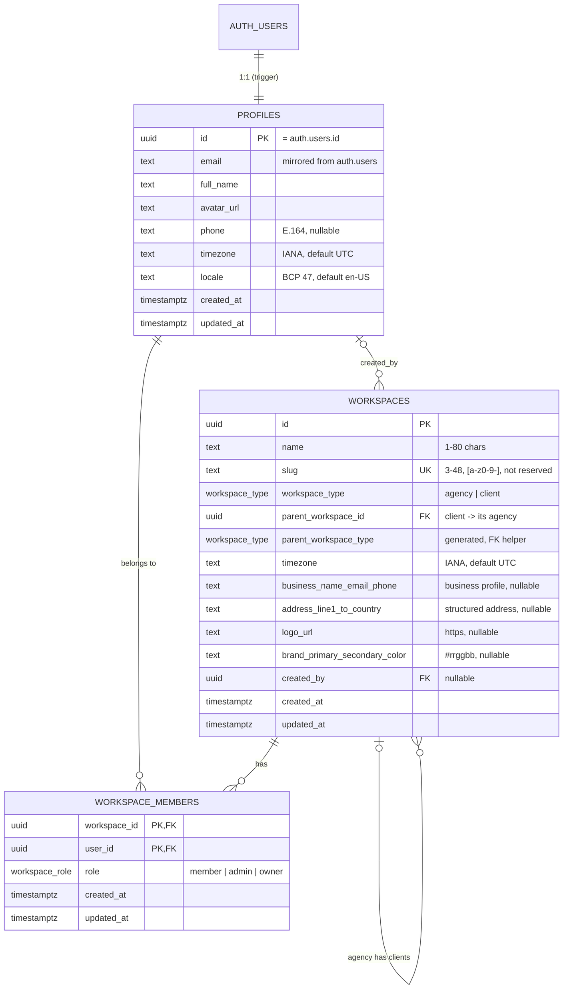

# Database

Supabase Postgres 17. The schema's source of truth is `supabase/migrations/`; this document
explains it. So far there is only the tenancy core (profiles, workspaces with the agency → client
hierarchy and business profile, memberships) and the auth rate-limit counters; product tables
arrive with their features.

| Migration                                             | Sprint | What it does                                                                                                                    |
| ----------------------------------------------------- | ------ | ------------------------------------------------------------------------------------------------------------------------------- |
| `20260918000000_tenancy_foundation.sql`               | 0      | Tables, RLS, grants, private helpers, triggers, `create_workspace()`.                                                           |
| `20260918120000_onboarding_workspace_creation.sql`    | 1      | Signup creates the profile only; `create_workspace()` can generate the slug; reserved slugs rejected.                           |
| `20260923000000_workspace_hierarchy_and_profiles.sql` | 2      | Agency/client hierarchy and access rule, workspace time zone + business profile, profile phone/time zone/locale, `viewer_role`. |
| `20260923000100_auth_rate_limits.sql`                 | 2      | `private.rate_limit_counters` + service-role-only `rate_limit_hit()` for app-level auth rate limits.                            |

## Schema



| Object                         | Purpose                                                                                              |
| ------------------------------ | ---------------------------------------------------------------------------------------------------- |
| `public.profiles`              | App-facing user data, one row per `auth.users` row. Never duplicate auth data beyond display fields. |
| `public.workspaces`            | The tenant. Everything a customer owns will reference one. Created in onboarding, not at signup.     |
| `public.workspace_members`     | Membership and role. Composite PK `(workspace_id, user_id)`, plus an index on `user_id`.             |
| `public.workspace_role` (enum) | `member < admin < owner`. Declaration order is privilege order; comparisons rely on it.              |
| `public.workspace_type` (enum) | `agency` (top level) or `client` (belongs to one agency). See "Agency → client hierarchy".           |
| `private.rate_limit_counters`  | Fixed-window counters for the app's auth rate limits. Not tenant data (no `workspace_id`).           |
| `private` schema               | Not exposed through the Data API. Holds SECURITY DEFINER helpers and trigger functions.              |

### Functions and triggers

| Name                                              | Kind                                 | Behaviour                                                                                                    |
| ------------------------------------------------- | ------------------------------------ | ------------------------------------------------------------------------------------------------------------ |
| `private.user_workspace_ids()`                    | helper, definer                      | Workspaces the caller can access: direct memberships **plus** clients of agencies where they're admin/owner. |
| `private.workspace_role(ws)`                      | helper, definer                      | The caller's effective role in `ws` (direct, or inherited from its agency), or null.                         |
| `private.has_workspace_role(ws, min_role)`        | helper, definer                      | True when the caller's effective role in `ws` is at least `min_role`.                                        |
| `public.viewer_role(workspaces)`                  | computed field, invoker              | `select=…,viewer_role` returns the caller's effective role per visible workspace.                            |
| `public.create_workspace(name, slug?, timezone?)` | RPC, definer                         | Creates an **agency** workspace and makes the caller owner, atomically. The only client path to create one.  |
| `public.rate_limit_hit(key, window)`              | RPC, definer, service_role only      | Counts one hit for a rate-limit key and returns hits and window end.                                         |
| `private.is_valid_timezone(text)`                 | helper, stable                       | True for IANA `Area/Location` names Postgres knows, and `UTC`. Used by CHECKs.                               |
| `private.handle_new_user()`                       | trigger on `auth.users` insert       | Creates the profile only (display fields from metadata, clipped to the column limits).                       |
| `private.slugify(text)`                           | helper, immutable                    | `'Café Münster & Co.'` → `'cafe-munster-co'`: NFKD accent folding, then non-alphanumerics → `-`.             |
| `private.is_reserved_workspace_slug(text)`        | helper, immutable                    | True for slugs kept for routes and subdomains (`www`, `app`, `api`, `admin`, `settings`, …).                 |
| `private.handle_user_email_change()`              | trigger on `auth.users` email update | Keeps `profiles.email` in sync.                                                                              |
| `private.protect_last_owner()`                    | trigger on `workspace_members`       | Blocks demoting or removing the last owner, and locks the workspace row to prevent races. Allows cascades.   |
| `private.set_updated_at()`                        | trigger                              | Maintains `updated_at` on every table.                                                                       |

All definer functions pin `search_path = ''` and schema-qualify every reference.

### Constraints on `workspaces.slug`

| Constraint                     | Rule                                             | App message (field `workspaceSlug`) |
| ------------------------------ | ------------------------------------------------ | ----------------------------------- |
| `workspaces_slug_check`        | `^[a-z0-9][a-z0-9-]{1,46}[a-z0-9]$` (3–48 chars) | "Use 3–48 lowercase letters, …"     |
| `workspaces_slug_key` (unique) | Globally unique                                  | "That URL is already taken."        |
| `workspaces_slug_not_reserved` | `not private.is_reserved_workspace_slug(slug)`   | "That URL is reserved."             |

Each is mirrored in `src/features/workspaces/lib/slug.ts` and `schemas.ts` so forms reject bad
input early, but the database is the final judge (`lib/write-errors.ts` maps violations to field
errors). CHECK constraints run their functions as the writing role, which is why `authenticated`
and `service_role` have `EXECUTE` on `is_reserved_workspace_slug`.

### `create_workspace(p_name, p_slug default null, p_timezone default null)`

- `p_slug` given: used as is; constraint errors reach the caller (`23514` invalid/reserved,
  `23505` taken).
- `p_slug` null or blank: the base is `slugify(name)` cut to 40 characters (room for a suffix).
  The plain base is tried first, unless it's shorter than 3 characters, reserved or empty (then
  `workspace`). On a collision it retries with a random `-xxxxxx` suffix, up to 5 attempts.
- Always inserts the owner membership for `auth.uid()` in the same transaction.
- `p_timezone`: the workspace time zone (the app passes the browser's, validated); null or blank
  means `UTC`, an invalid zone fails with `23514` (`workspaces_timezone_check`).
- Always creates an **agency** (top-level) workspace. Sprint 1's two-argument calls, with named
  arguments, keep working.

Generating the slug in SQL is deliberate: RLS hides other tenants' workspaces, so the app can't
check availability without a lookup endpoint that would leak which slugs exist.

## Agency → client hierarchy

A workspace is an `agency` or a `client`. Clients belong to exactly one agency; agencies have no
parent. Depth is one level, by construction.

| Invariant                                    | Enforced by                                                                                                                |
| -------------------------------------------- | -------------------------------------------------------------------------------------------------------------------------- |
| agency ⇒ no parent; client ⇒ a parent        | `workspaces_hierarchy_check`                                                                                               |
| not its own parent                           | `workspaces_not_own_parent`                                                                                                |
| the parent is an agency (so depth is 1)      | `workspaces_parent_fkey`: (`parent_workspace_id`, generated `parent_workspace_type` = 'agency') → (`id`, `workspace_type`) |
| an agency with clients can't become a client | the same key (`on update restrict`)                                                                                        |
| deleting an agency with clients fails        | the same key (`on delete restrict`): clients are removed or moved first, never cascaded                                    |
| nobody re-parents or re-types via the API    | no `UPDATE` grant on `workspace_type`/`parent_workspace_id`; trusted functions only                                        |

**Access rule** (in `user_workspace_ids()` and `workspace_role()`; change both together):

- direct membership always works, with its role;
- an agency **owner** or **admin** reaches every client of that agency, as owner or admin;
- an agency **member** gets nothing in clients unless added to them;
- someone with both gets the higher role;
- the join only follows agency → client, so client members never reach their agency or siblings,
  and nobody reaches another agency's clients.

Because every policy calls these two helpers, the rule applies to `workspaces`,
`workspace_members` and `profiles` today and to every future tenant table automatically: an agency
admin can administer a client's data exactly as a client admin can. The RLS suite proves it
(`supabase/tests/agency-hierarchy.test.ts`).

Existing data: the Sprint 2 migration made every existing workspace an `agency` without a parent,
`timezone = 'UTC'`, and gave every profile `timezone = 'UTC'`, `locale = 'en-US'`. Nothing else
changed; access stayed identical (tested).

## Business profile and time zones

Columns on `public.workspaces` (all nullable unless noted; the app sends null, never `''`):

| Column                                         | Rule (constraint)                                         |
| ---------------------------------------------- | --------------------------------------------------------- |
| `timezone` (not null, default `'UTC'`)         | `private.is_valid_timezone` (`workspaces_timezone_check`) |
| `business_name`                                | 1–120 characters after trimming                           |
| `business_email`                               | ≤ 254, `local@domain.tld` shape                           |
| `business_phone`                               | E.164: `^\+[1-9][0-9]{6,14}$`                             |
| `address_line1`, `address_line2`               | 1–200 each                                                |
| `address_city`, `address_region`               | 1–100 each                                                |
| `address_postal_code`                          | 1–20                                                      |
| `address_country`                              | ISO 3166-1 alpha-2, uppercase                             |
| `logo_url`                                     | `https://…`, ≤ 2048                                       |
| `brand_primary_color`, `brand_secondary_color` | `#rrggbb`, lowercase                                      |

On `public.profiles`: `phone` (E.164), `timezone` (not null, default `'UTC'`, same check),
`locale` (not null, default `'en-US'`, BCP 47 `language[-Script][-REGION]`).

`is_valid_timezone` accepts `UTC` and `Area/Location[/…]` names with canonical capitalisation
that Postgres can resolve, and rejects offsets (`-5`, `-05:00`), POSIX strings (`UTC+5`),
`Etc/GMT±N` and abbreviations. Each constraint is mirrored in the Zod schemas and mapped back to a
form field if the database ever rejects a value (`features/workspaces/lib/write-errors.ts`).

## Rate-limit counters

`private.rate_limit_counters(key, hits, window_ends_at)` holds fixed-window counters for the app's
auth rate limits (`src/lib/rate-limit`). It lives in `private` (not exposed), has RLS enabled with
no policies, and is written only by `public.rate_limit_hit(key, window_seconds)`, which only
`service_role` may execute: the publishable key can neither read counters nor spend someone else's
budget. Keys are `<policy>:<sha-256 prefix>`, so no emails or IPs are stored. About one call in a
hundred deletes counters that expired over an hour ago, keeping the table small without a
scheduler.

## Workspace and membership model

- A user can belong to any number of workspaces; each membership has one role
  (`member < admin < owner`). The creator of a workspace is its owner.
- **Onboarding invariant**: a user with no membership is sent to onboarding. Signup no longer
  creates a workspace, so the first one is always named by the user.
- A workspace always keeps at least one owner (`protect_last_owner` trigger).
- Memberships are created only by definer functions: `create_workspace()` today,
  `accept_invitation()` for team members next. There is no `INSERT` grant, so nobody can add
  themselves or anyone else directly.
- Roles are enforced by RLS: members read; admins rename, change the URL and edit the business
  profile; owners delete and manage ownership. "Admin" and "owner" include agency admins and owners
  acting in their agency's clients.

## Access model

Grants are least-privilege. RLS then limits _which rows_ a granted verb can touch.

| Table               | `anon` | `authenticated` grants                                                        | RLS policy (authenticated)                                                                                                                      |
| ------------------- | ------ | ----------------------------------------------------------------------------- | ----------------------------------------------------------------------------------------------------------------------------------------------- |
| `profiles`          | none   | `SELECT`; `UPDATE (full_name, avatar_url, phone, timezone, locale)`           | Read self and co-members of any accessible workspace. Update self only.                                                                         |
| `workspaces`        | none   | `SELECT`; `UPDATE (name, slug, timezone, business profile columns)`; `DELETE` | Read if accessible. Update if admin or above. Delete if owner. No `INSERT` (use `create_workspace`); no update of type, parent or `created_by`. |
| `workspace_members` | none   | `SELECT`; `UPDATE (role)`; `DELETE`                                           | Read co-members. Admins change roles and remove members, but only owners touch owner rows. Anyone can leave. No `INSERT`.                       |

`service_role` (the secret key) bypasses RLS. See the admin-client rules in `ARCHITECTURE.md`.

**Why no INSERT on memberships?** Direct inserts would let an admin add any user id to their
workspace without consent. Memberships are created only by trusted functions:
`create_workspace` and the planned `accept_invitation`.

## Conventions for new tables

1. **Tenant-owned data** gets `workspace_id uuid not null references public.workspaces (id) on delete cascade`,
   an index that leads with `workspace_id`, and the standard policies below. They cover agency
   access automatically; never re-implement the hierarchy in a policy.
2. Primary keys are `uuid default gen_random_uuid()`. Timestamps are `timestamptz`, with
   `created_at`/`updated_at` plus the `private.set_updated_at()` trigger.
3. Enable RLS in the **same migration** that creates the table, with explicit grants.
4. Check constraints for invariants (lengths, formats). Mirror them in the feature's Zod schema.
5. `jsonb` is for documents with their own versioned schema (e.g. page content), not for
   avoiding modelling. Add a `schema_version int not null` next to it.
6. Soft deletes only when there's a product need (e.g. restore). Otherwise cascade.
7. Add RLS tests to `supabase/tests/` in the same PR (see `docs/QA.md`), including one for agency
   access (agency admin reaches the client's rows, agency member doesn't).
8. **Snapshot-ready** (docs/ARCHITECTURE.md "Snapshot-readiness rules"): slugs and other
   human-readable keys are `unique (workspace_id, …)`, never global; clonable entities get a
   nullable `source_key text` with `unique (workspace_id, source_key)`; credentials live in their
   own tables, never next to clonable configuration.
9. Time columns are `timestamptz`. When something happens "at 9am" for a business, store the
   IANA zone it's relative to (usually the workspace's `timezone`), not an offset.

### Template: tenant-scoped table

```sql
create table public.funnels (
  id uuid primary key default gen_random_uuid(),
  workspace_id uuid not null references public.workspaces (id) on delete cascade,
  name text not null check (char_length(btrim(name)) between 1 and 120),
  created_at timestamptz not null default now(),
  updated_at timestamptz not null default now()
);

create index funnels_workspace_id_idx on public.funnels (workspace_id);

create trigger funnels_set_updated_at
  before update on public.funnels
  for each row execute function private.set_updated_at();

alter table public.funnels enable row level security;

create policy "funnels: members can read"
  on public.funnels for select to authenticated
  using (workspace_id in (select private.user_workspace_ids()));

create policy "funnels: members can create"
  on public.funnels for insert to authenticated
  with check (workspace_id in (select private.user_workspace_ids()));

create policy "funnels: members can update"
  on public.funnels for update to authenticated
  using (workspace_id in (select private.user_workspace_ids()))
  with check (workspace_id in (select private.user_workspace_ids()));

create policy "funnels: admins can delete"
  on public.funnels for delete to authenticated
  using (private.has_workspace_role(workspace_id, 'admin'));

revoke all on table public.funnels from anon, authenticated;
grant select, insert, delete on table public.funnels to authenticated;
grant update (name) on table public.funnels to authenticated;
grant all on table public.funnels to service_role;
```

Notes:

- `workspace_id in (select private.user_workspace_ids())` is evaluated once per statement, not
  per row. Keep that form for large tables.
- Only `UPDATE (name)` is granted, so `workspace_id` can't be changed at all and rows can't
  move between tenants. The `WITH CHECK` is a second line of defence if a broader grant is ever
  added.

## Migration workflow

```bash
npm run db:start                       # local Supabase (Docker required)
npm run db:migration:new add_funnels   # creates supabase/migrations/<timestamp>_add_funnels.sql
# write SQL, then:
npm run db:reset                       # re-applies all migrations + seed.sql locally
npm run test:db                        # RLS suite on PGlite (no Docker needed)
npm run db:types                       # regenerate src/types/database.types.ts
```

> `src/types/database.types.ts` is generated (first regenerated in Sprint 1; it matched the
> earlier hand-written version). Never edit it by hand: change the migration, then regenerate.

- Migrations are append-only once merged. Fix mistakes with a new migration.
- Keep migrations deterministic and idempotent where cheap (`if not exists` on extensions and schemas).
- Deploy with `supabase link --project-ref <ref>` and `supabase db push`, from CI or a release
  step, staging before production.
- Destructive changes (drop or rename column) take two releases: stop using it, then drop it.

## Future extension points

These are anticipated tables, sketched so that today's decisions don't block them. They are not built.

| Area            | Likely tables                                             | Notes                                                                                                                 |
| --------------- | --------------------------------------------------------- | --------------------------------------------------------------------------------------------------------------------- |
| Invitations     | `workspace_invitations`                                   | Hashed token, email, role, expiry; `accept_invitation(token)` definer function inserts membership.                    |
| Agency clients  | functions on `workspaces`                                 | `create_client_workspace(agency, …)`, move/detach: definer functions checking agency admin rights (no column grants). |
| Snapshots       | `snapshots`, `snapshot_items`, `snapshot_deployments`     | Allowlisted, `source_key`-addressed content; deploy remaps ids; never credentials.                                    |
| Funnels & pages | `funnels`, `funnel_steps`, `pages`, `page_versions`       | `pages.content jsonb` + `schema_version`. Versions are immutable snapshots; publishing points at one.                 |
| Publishing      | `sites`, `site_deployments`                               | Public reads through a definer function or view that exposes only published snapshots.                                |
| Custom domains  | `domains`                                                 | Globally unique hostname, verification status, workspace-scoped management.                                           |
| Forms           | `forms`, `form_submissions`                               | Anonymous submissions go through a definer function, rate-limited, never with a blanket `anon` grant.                 |
| Contacts        | `contacts`, `contact_events`, `tags`                      | Unique `(workspace_id, lower(email))`, with high-volume indexes led by `workspace_id`.                                |
| Email           | `email_campaigns`, `email_messages`, `email_suppressions` | Provider message ids plus webhook-driven status updates.                                                              |
| Automations     | `automations`, `automation_runs`, `jobs`                  | Postgres-backed job queue first (Supabase Queues / `pg_cron`).                                                        |
| AI              | `ai_generations`, `ai_usage`                              | Prompts and outputs are auditable, with usage metered per workspace for billing.                                      |
| Billing         | `billing_customers`, `subscriptions`, `plan_limits`       | Written only by Stripe webhooks (service role); read by members.                                                      |
| Audit           | `audit_log`                                               | Append-only, written by triggers or definer functions.                                                                |
