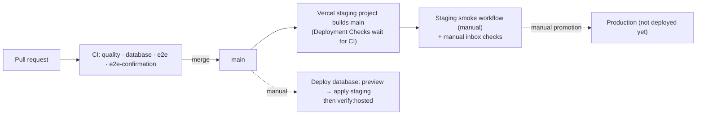

# Deployment

How DreamFunnels runs in each environment, how changes reach them, and what has to be set up by
hand. Values never appear here, only variable **names**; secrets live in Vercel, the GitHub
Environments and the Supabase dashboard.

> **Status (Sprint 4, 2026-09-24):** local and CI are fully automated. **Staging does not exist
> yet**: no Supabase project, Vercel project, Resend domain or Turnstile widget has been created
> (the Vercel team has no DreamFunnels project). Everything below marked **MANUAL** is the
> checklist to create it; the repository side (workflows, gates, smoke suite) is ready.
> Nothing is deployed to production.

## Environments

|                    | Local                                          | Staging                                                   | Production (planned)                                |
| ------------------ | ---------------------------------------------- | --------------------------------------------------------- | --------------------------------------------------- |
| Purpose            | Development, unit/RLS/E2E tests, CI            | Hosted rehearsal of production: real Auth, email, CAPTCHA | Customers                                           |
| Supabase           | Local stack (`npm run db:start`, Docker)       | Its own project `dreamfunnels-staging` (Free)             | Its own project (Pro)                               |
| `APP_ENV`          | `local` (default)                              | `staging`                                                 | `production`                                        |
| App hosting        | `next dev` / `next start`                      | Vercel project for staging, deploys `main` automatically  | Vercel, **manual promotion only**                   |
| Email confirmation | Off (`supabase/config.toml`); on in one CI job | **On**                                                    | **On**                                              |
| Auth email (SMTP)  | Mailpit (local stack)                          | Supabase custom SMTP → Resend                             | Supabase custom SMTP → Resend                       |
| App email          | Mailpit (`EMAIL_PROVIDER` empty)               | Resend (`EMAIL_PROVIDER=resend`)                          | Resend, verified domain (never `@resend.dev`)       |
| Turnstile          | Off (no keys)                                  | Cloudflare's always-pass **test** keys                    | Real keys for the production hostname               |
| Migrations         | `supabase start` / `migration up --local`      | **Deploy database** workflow, target `staging`            | **Deploy database**, target `production`, confirmed |
| Tests              | `npm run check`, `npm run test:e2e`            | `npm run verify:hosted`, **Staging smoke** workflow       | `npm run verify:hosted` (read-only)                 |

Never point two environments at one Supabase project, and never put production credentials into
staging, CI or a pull request. Ordinary CI needs no secrets at all: it runs its own local stack
with the well-known development keys.

### Environment variables (names only)

Every variable in `.env.example`, per environment. "—" means leave it unset.

| Variable                                              | Local                   | Staging (Vercel)              | Production (Vercel)            |
| ----------------------------------------------------- | ----------------------- | ----------------------------- | ------------------------------ |
| `APP_ENV`                                             | —                       | `staging`                     | `production`                   |
| `NEXT_PUBLIC_APP_URL`                                 | `http://localhost:3000` | staging URL (https)           | production URL (https)         |
| `NEXT_PUBLIC_SUPABASE_URL`                            | local stack             | staging project (https)       | production project (https)     |
| `NEXT_PUBLIC_SUPABASE_PUBLISHABLE_KEY`                | local stack             | staging project               | production project             |
| `SUPABASE_SECRET_KEY`                                 | local stack (optional)  | staging project (**secret**)  | production (**secret**)        |
| `NEXT_PUBLIC_TURNSTILE_SITE_KEY`                      | —                       | Cloudflare test site key      | real site key                  |
| `TURNSTILE_SECRET_KEY`                                | —                       | Cloudflare test secret key    | real secret (**secret**)       |
| `EMAIL_PROVIDER`                                      | —                       | `resend`                      | `resend`                       |
| `EMAIL_FROM_ADDRESS`                                  | —                       | address on the sending domain | address on the verified domain |
| `EMAIL_FROM_NAME`                                     | —                       | optional                      | optional                       |
| `RESEND_API_KEY`                                      | —                       | staging key (**secret**)      | production key (**secret**)    |
| `MAILPIT_URL`                                         | optional                | —                             | —                              |
| `LOG_LEVEL`                                           | optional                | optional                      | optional                       |
| `NEXT_PUBLIC_SENTRY_DSN`, `SENTRY_AUTH_TOKEN`         | —                       | optional (not wired yet)      | optional (not wired yet)       |
| `NEXT_PUBLIC_POSTHOG_KEY`, `NEXT_PUBLIC_POSTHOG_HOST` | —                       | optional (not wired yet)      | optional (not wired yet)       |
| `E2E_REQUIRE_SUPABASE`                                | tests only              | —                             | —                              |

`next.config.ts` validates the set at build time (`parseDeploymentEnv`): a staging or production
build fails, listing every problem by name, when anything required is missing, when a URL is http
or loopback, or (production) when Cloudflare's test keys or Resend's `@resend.dev` sender are used.

## Release flow

- **Staging deploys itself**: the staging Vercel project's production branch is `main`, and its
  Deployment Checks hold the release until the CI workflow's jobs have passed on that commit
  (Vercel's Git integration; no custom deploy code).
- **Migrations**: they're additive (append-only; a destructive change takes two releases), so
  the old code keeps working on the new schema. The GitHub Environment only deploys from `main`,
  so on staging run **Deploy database** (preview, then apply) right after merging a migration;
  until it has run, staging serves the new build against the old schema and the new paths
  fail (staging only, minutes). For production the order is strict: migrate first, then
  promote the build.
- **Production is always a manual promotion**, after staging passed the smoke and the manual
  checks.

## Setting up staging (MANUAL, in this order)

### 1. Supabase project (MANUAL)

Create `dreamfunnels-staging` on the **Free** plan, in the region closest to users. **Never** reuse
or touch another project (in particular not "BrightROI Blog"). Then, in the dashboard:

| Setting                    | Where                                                            | Value                                                                                                                                       |
| -------------------------- | ---------------------------------------------------------------- | ------------------------------------------------------------------------------------------------------------------------------------------- |
| Confirm email              | Authentication → Sign In / Providers → Email                     | **On**                                                                                                                                      |
| Minimum password length    | Authentication → Sign In / Providers → Email (password settings) | 8 (matches `PASSWORD_MIN_LENGTH`)                                                                                                           |
| Site URL                   | Authentication → URL Configuration                               | the staging `NEXT_PUBLIC_APP_URL`                                                                                                           |
| Redirect URLs              | Authentication → URL Configuration                               | `<staging APP_URL>/auth/callback` (exact; no wildcards)                                                                                     |
| Email templates            | Authentication → Emails → Templates                              | "Confirm signup" = `supabase/templates/confirmation.html`, "Reset password" = `recovery.html`, subjects as in `config.toml`                 |
| Custom SMTP                | Authentication → Emails → SMTP Settings                          | host `smtp.resend.com`, port `465`, username `resend`, password = a Resend API key (secret), sender email and name from the verified domain |
| Email rate limit           | Authentication → Rate Limits                                     | Custom SMTP starts at 30 emails/hour; keep it unless staging tests need more                                                                |
| JWT signing keys           | Project Settings → JWT Keys                                      | migrate to JWT signing keys, rotate to the ECC (P-256) key                                                                                  |
| Password recovery          | (templates above + Site URL)                                     | recovery links land on `/auth/callback` → `/reset-password`                                                                                 |
| Sessions                   | Authentication → Sessions                                        | defaults (refresh-token rotation on); time-boxing is a Pro feature                                                                          |
| Supabase CAPTCHA           | Authentication → Attack Protection                               | **Off**: Turnstile is verified by the app (ARCHITECTURE decision 29)                                                                        |
| Leaked-password protection | Authentication → Sign In / Providers → Email                     | Pro plan only; turn it on when staging moves to Pro                                                                                         |

Settings verified against the current Supabase and Resend documentation (auth-smtp,
redirect-urls, password-security; Resend "Send emails with Supabase SMTP"), September 2026.

**Upgrade staging to Pro when** pausing after a week of inactivity starts disrupting
development, Free limits (database size, egress, MAU, email rate) start to matter,
production-like load or backup/restore testing is needed, or paying clients depend on staging
(e.g. agencies previewing snapshots).

### 2. Resend and the sending domain (MANUAL)

Add a sending **subdomain** (e.g. `mail.<your domain>`: it keeps the reputation separate from the
main domain) in Resend, and publish the records Resend shows at the DNS provider:

| Record                                         | Purpose                                                                                                                                          |
| ---------------------------------------------- | ------------------------------------------------------------------------------------------------------------------------------------------------ |
| SPF (TXT on the bounce subdomain Resend names) | Authorises Resend's servers to send for the domain.                                                                                              |
| MX (on that bounce subdomain)                  | Receives bounces and complaints for the return path.                                                                                             |
| DKIM (TXT `resend._domainkey…`)                | Signs every message so receivers can verify it wasn't altered.                                                                                   |
| DMARC (TXT `_dmarc.<domain>`)                  | Tells receivers what to do with mail failing SPF/DKIM; start with `p=none` and a report address, tighten to `quarantine` once reports are clean. |

Wait until Resend shows **Verified**. Create one API key per environment with **Sending access**
only. The sender address comes only from `EMAIL_FROM_ADDRESS`; nothing in the code names a domain.
Record values are shown by Resend per domain; they are never copied into this repository.

### 3. Cloudflare Turnstile (MANUAL)

Staging uses Cloudflare's documented **test keys**: the site key that always passes (visible
widget) and the matching always-pass secret (Turnstile docs, "Testing"). They exercise the real
widget and the real `siteverify` call without challenges, work on any hostname, and are rejected
by the production build. Production gets a real widget created for its hostname.

### 4. Vercel project for staging (MANUAL)

Create a Vercel project for staging from the GitHub repository (Git integration):

1. Framework Next.js, root `/`, Node.js version per `.nvmrc`, install `npm ci`, build `npm run build`.
2. **Production branch `main`**: every merge deploys staging. (This project's "Production"
   environment _is_ staging, hence `APP_ENV=staging`; the schema only forbids `local` on Vercel.)
3. Environment variables: every name in the table above with the staging values, for the
   Production environment of this project (and Preview only if previews should run against
   staging too).
4. Domain: assign the staging hostname (e.g. `staging.<your domain>`); it must equal
   `NEXT_PUBLIC_APP_URL` and the Supabase Site URL.
5. **Deployment Checks** (Settings → Deployment Checks → Add → GitHub): require the CI jobs
   `Typecheck · Lint · Test · Build`, `Database (migrations · db lint · type drift)`,
   `E2E (Playwright + local Supabase)` and `E2E with email confirmation (Mailpit)`, so a commit
   only reaches the staging domain after CI passed on it.
6. Leave Vercel's Deployment Protection so previews aren't public, but keep the staging domain
   reachable by the smoke workflow (or add a protection bypass for automation).

### 5. GitHub Environment "staging" (MANUAL)

Settings → Environments → New environment `staging` (deployment branches: `main` only).

| Kind     | Name                                   | Used by                                            |
| -------- | -------------------------------------- | -------------------------------------------------- |
| secret   | `SUPABASE_ACCESS_TOKEN`                | Deploy database (CLI link and push)                |
| secret   | `SUPABASE_DB_PASSWORD`                 | Deploy database                                    |
| secret   | `SUPABASE_SECRET_KEY`                  | Staging smoke (creates/deletes its own test users) |
| variable | `SUPABASE_PROJECT_REF`                 | Deploy database                                    |
| variable | `NEXT_PUBLIC_SUPABASE_URL`             | both                                               |
| variable | `NEXT_PUBLIC_SUPABASE_PUBLISHABLE_KEY` | both                                               |
| variable | `NEXT_PUBLIC_APP_URL`                  | both (the staging URL)                             |
| variable | `PRODUCTION_APP_URL`                   | Staging smoke (refused as a target; optional)      |
| variable | `PRODUCTION_SUPABASE_URL`              | Staging smoke (refused as a target; optional)      |

The CI workflow never reads any environment: pull requests can't reach staging or production
secrets. Create `production` the same way later, with **required reviewers**, its own values, and
never `SUPABASE_SECRET_KEY` (no suite writes to production).

### 6. First bring-up

1. **Deploy database** → `staging`, preview (default), read the plan; run again with **apply** and
   **auth_only** (the app isn't deployed yet).
2. Let Vercel deploy `main`; open `<staging URL>/api/health`: `"environment": "staging"`.
3. **Deploy database** → `staging`, apply (no-op) without auth_only: the full hosted gate.
4. **Staging smoke** workflow.
5. The manual checks below.

## Database deployments

`.github/workflows/deploy-database.yml` (manual dispatch):

- **Inputs**: `environment` (staging | production), `apply` (default off = preview only),
  `confirm_project_ref` (production: must equal its `SUPABASE_PROJECT_REF`), `auth_only`.
- **Steps**: check the target's variables (and that the Supabase URL belongs to the project ref)
  → link → `supabase migration list` → `supabase db push --dry-run` → (apply) `supabase db push`
  → (apply) `npm run verify:hosted` with `VERIFY_EXPECT_APP_ENV` = the target.
- **Never** resets, repairs or drops. There is no reset path in any workflow;
  `npm run db:reset` is `supabase db reset --local` (local only).
- Production is hard to hit by accident: the GitHub Environment's required reviewers, typing the
  project ref, and the job name says "Migrate production".

## Hosted verification

`npm run verify:hosted` is the gate for staging and production. It uses public endpoints and the
publishable key only, prints PASS/FAIL/WARN per check and never prints keys:

| Check                            | Fails when                                                                                                       |
| -------------------------------- | ---------------------------------------------------------------------------------------------------------------- |
| Supabase URL                     | not https, or this machine                                                                                       |
| Email confirmation required      | `mailer_autoconfirm` is true                                                                                     |
| Email sign-up enabled            | sign-ups disabled or the Email provider off                                                                      |
| Asymmetric JWT signing key       | the JWKS has no EC/RSA/OKP key                                                                                   |
| App URL                          | not https, or this machine                                                                                       |
| Health endpoint                  | not 200/`ok`, cacheable, or `environment` ≠ `VERIFY_EXPECT_APP_ENV` (or `local`)                                 |
| Security headers                 | nosniff, referrer policy, `DENY` framing or permissions policy missing; `X-Powered-By` present                   |
| Strict-Transport-Security        | **warning only** (the host adds it)                                                                              |
| Auth callback rejects a bad link | a bogus `token_hash` isn't a same-site redirect to `/login?error=auth_callback_failed`, or sets a session cookie |
| Invitation page is private       | `/invite/<random>` isn't `no-store` + `noindex`                                                                  |

It can't see dashboard-only settings; those stay **manual checks** per environment:

- Site URL and redirect allow-list; the email templates (token_hash links); SMTP sender.
- Minimum password length; Supabase CAPTCHA off; sessions.
- Turnstile: the widget appears on sign-up and forgot-password, and the button waits for it.
- Resend domain **Verified**; SPF/DKIM/DMARC pass (check a received message's headers).
- A real inbox receives, from the right sender: the **sign-up confirmation**, the **password
  reset** and an **invitation** email, each with working links (open one on another device).
- Rate limits: eleven wrong passwords for one address within 15 minutes end in "Too many
  attempts"; repeated sign-ups and resets from one IP are limited; more than 30 invitations an
  hour from one person are refused. (The app's limiter runs on Postgres in staging because
  `SUPABASE_SECRET_KEY` is set; nothing new is needed.)

## Staging smoke

`npm run test:staging` (`playwright.staging.config.ts`, `e2e-staging/`), run by the **Staging
smoke** workflow in the `staging` GitHub Environment; never on pull requests.

- Guards (before any test): the base URL must be exactly `STAGING_APP_URL` over https; not
  `PRODUCTION_APP_URL`; the Supabase project hosted and not `PRODUCTION_SUPABASE_URL`; the
  publishable and secret keys present; then `/api/health` must report `staging`.
- Journey: landing → sign-up through the real Turnstile widget → confirmation (a token_hash link
  from the admin API, since real inboxes can't be read) → onboarding → workspace → client →
  invitation (the database records delivery `sent`, i.e. Resend accepted it) → the invitee
  accepts from the onboarding pending-invitation list → member visible → member view (no invite,
  no audit log) → another workspace is "not found" → sign out → sign in again.
- Test users are `delivered+e2e-staging-<label>-<random>@resend.dev` (Resend's delivery test
  inbox: real sends, no bounces). The run deletes exactly the users and workspaces it created,
  and refuses to delete any other address.
- Plus the manual inbox checks above.

## Production (planned; nothing deployed)

- Its own Supabase project on **Pro** (backups, no pausing, leaked-password protection), the same
  Auth settings as staging, a verified Resend domain, real Turnstile keys, `APP_ENV=production`.
- Vercel: manual promotion only (e.g. a separate production project whose production branch is
  not `main`, or production auto-assignment turned off and "Promote to Production" by hand).
- GitHub Environment `production` with required reviewers; **Deploy database** needs the project
  ref typed in. No workflow creates or deletes data in production; `verify:hosted` is read-only.
- The E2E suites refuse it: the local suites only run against loopback URLs, and the staging
  smoke refuses `PRODUCTION_APP_URL` / `PRODUCTION_SUPABASE_URL` and anything that isn't
  `STAGING_APP_URL` reporting `staging`.

## Security headers and CSP

The headers in `next.config.ts` are unchanged (nosniff, strict referrer policy, `DENY` framing,
permissions policy, no `X-Powered-By`). **No Content-Security-Policy yet.** Before any
tenant-authored page, form or funnel is served, a CSP gate is required: nonce-based `script-src`
for the app (Next's nonce support via the proxy), `frame-ancestors` per surface (the app `none`,
published pages as the tenant allows), tenant pages on their own origin (custom domains or a
separate apex) so they never share the app's cookies, and a report-only rollout first.

## Custom domains readiness

No hostname is hard-coded: links come from `NEXT_PUBLIC_APP_URL`, redirects are same-origin
paths, and the only `localhost` references are local defaults and test guards. Custom domains
will plug into `proxy.ts` (host → tenant site renderer); see ARCHITECTURE "Extension points".

## Email reliability (not built; integration points)

- **Retry queue**: `sendInvitationEmail()` already records `delivery_status` per token; a job
  table + worker (Supabase Queues / `pg_cron`) can retry `failed` rows without changing callers.
- **Bounce and complaint webhooks**: a route handler verifying Resend's webhook signature, using
  the admin client to update delivery status by `last_message_id`.
- **Delivery events and suppression**: an `email_suppressions` table checked before sending,
  fed by those webhooks.

## Operational follow-ups

- **Audit log retention (1 year)**: `private.audit_log` rows older than a year should be deleted
  by a scheduled job (e.g. `pg_cron` calling a definer function, or a Vercel Cron). Not built this
  sprint; until then rows are kept, which errs on the side of keeping evidence.
- Remove the PostgREST retry (`lib/supabase/postgrest-retry.ts`) once hosted projects run
  PostgREST ≥ 16.3.
